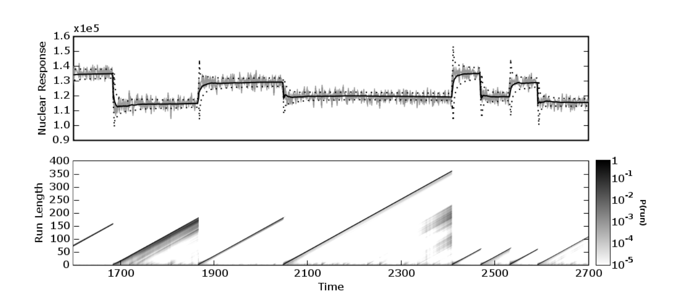
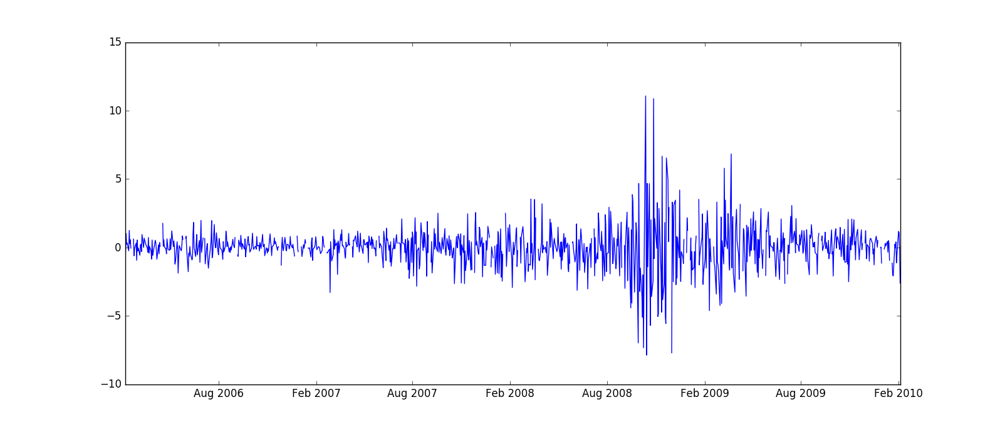
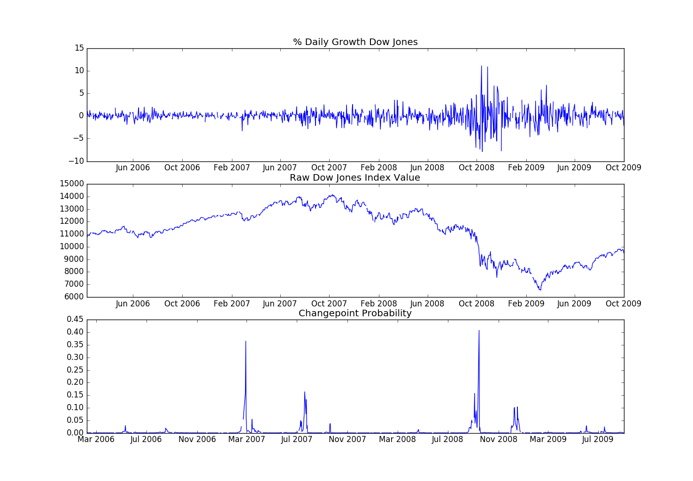

<script src="../turi/js/recview.js"></script>
#Bayesian Changepoints
The [`Bayesian Changepoints`](https://turi.com/products/create/docs/generated/graphlab.toolkits.anomaly_detection.bayesian_changepoints.create.html) model scores changepoint probability in a univariate sequential dataset, often a time series. Changepoints are abrupt changes in the mean or variance of a time series. For instance, during an economic recession, stock values might suddenly drop to a very low value. The time at which the stock value dropped is called a changepoint.

#### Background
The Bayesian Changepoints model is an implementation of the [Bayesian Online Changepoint Detection](https://hips.seas.harvard.edu/files/adams-changepoint-tr-2007.pdf) algorithm developed by Ryan Adams and David MacKay. This algorithm computes a probability distribution over the possible run lengths at each point in the data, where run length refers to the number of observations since the last changepoint. When the probability of a 0-length run spikes, there is most likely a change point at the current data point.  

**Step 1:** Observe new datum $$x_t$$ and evaluate the likelihood of seeing this value for each possible run length. This is a probability vector, with an element for all possible run lengths. This algorithm assumes a Gaussian distribution between each pair of changepoints.
$$
   L(r) = P(x|x_r)
$$

**Step 2:** For each possible run length $$r>0$$ at current time $$t$$, calculate the probability of growth. `expected_runlength` is a parameter describing the a-priori best guess of run length. The larger `expected_runlength` is, the stronger the evidence must be in the data to support a high changepoint probability.   
$$
  P_t(runlength = r) = P_{t-1}(runlength = r-1) * L(r) * (1 - 1/expected\_runlength)
$$

**Step 3:** Calculate probability of change, or $$r=0$$.
$$
  P_t(runlength = 0) = \sum_{r\_prev} (P_{t-1}(runlength = r\_prev) * L(0) * (1/expected\_runlength)
$$

**Step 4:** Normalize the probability. For all run length probabilities at time $$t$$, divide by the sum of all run length probabilities.
$$
  P_t(runlength = r\_i) = \frac{P_t(runlength = r\_i)}{\sum_{r} P_t(runlength = r)}
$$

For each incoming point, repeat this process. This per-point update is why the method is considered an **online** learning algorithm.

The output of this model as is a probability distribution of run lengths for each point in the training data. A good example of what this might look like comes from the origninal [paper] (https://hips.seas.harvard.edu/files/adams-changepoint-tr-2007.pdf). This comes from Figure 2.   



However, such a distribution is not the desired output of a single changepoint probability for each point. However, the desired output can be obtained by looking at the probability of run length 0 at each point.

As described, the algorithm scores each point $$x_t$$ immediately, but if the user can afford to wait several observations, it is often more accurate to assign *lagged* changepoint scores. The number of observations to wait before scoring a point is set with the `lag` parameter.

#### Data and context
The [Dow Jones Industrial Average](https://en.wikipedia.org/wiki/Dow_Jones_Industrial_Average) is an aggregate index of the stock prices of 30 large US companies. Since the stock market goes through ups and downs, and the United States has gone through significant growth and recession, it'd be interesting to see if we can identify when the market has made sudden changes.

We're interested in the daily percent growth to identify periods of change in the US market. This data, from 2/3/2006 to 2/4/2010, can be downloaded from the website from the [Federal Reserve Bank of St. Louis](https://research.stlouisfed.org/fred2/series/DJIA/downloaddata). In order to make things easy, though, we've uploaded the csv file to a public s3 bucket.

We load the file into an SFrame, and convert the values to floats. As a last formatting step, we convert the dataset into a [`TimeSeries`](https://turi.com/products/create/docs/generated/graphlab.TimeSeries.html) by converting the `DATE` column as `datetime.datetime` type and setting that column as the index.

```python
# Set up
import graphlab  as gl

# Download data.
dow_jones = gl.SFrame.read_csv('https://static.turi.com/datasets/changepoint_djia/DJIA.csv')
dow_jones['VALUE'] = dow_jones['VALUE'].apply(lambda x: None if x == '.' else float(x))
dow_jones['DATE'] = dow_jones['DATE'].str_to_datetime()

dow_jones = gl.TimeSeries(dow_jones, index='DATE')

```
Our final dataset `dow_jones` has 1045 daily percent returns, from February 3, 2006 to February 4, 2010. You can clearly see the economic downturn of 2008 if you plot it.  

```python
dow_jones.print_rows(5)
```
```no-highlight
+---------------------+----------+
|         DATE        |  VALUE   |
+---------------------+----------+
| 2006-02-03 00:00:00 |   None   |
| 2006-02-06 00:00:00 | 0.04308  |
| 2006-02-07 00:00:00 | -0.44924 |
| 2006-02-08 00:00:00 | 1.01267  |
| 2006-02-09 00:00:00 | 0.22775  |
+---------------------+----------+
[1045 rows x 2 columns]
```



Later in this chapter, we'll illustrate how Bayesian Changepoints models can be updated with new data. To do so, we set aside the last 90 days of data.

```python
## Split dataset into original and update sets.
dow_jones_part1 = dow_jones[:-90]
dow_jones_part2 = dow_jones[90:]
```


#### Basic Bayesian Changepoints Usage

The Bayesian Changepoints model takes an [`SFrame`](https://turi.com/products/create/docs/generated/graphlab.SFrame.html) or [`TimeSeries`](https://turi.com/products/create/docs/generated/graphlab.TimeSeries.html) as input (`dow_jones` in this case), the name of the column that contains the series to model, the number of time points to wait before evaluating the changepoint probability, and the expected number of observations between changepoints. For this analysis our feature is the the "VALUE" column and we use a 20 day lag, since it takes a while to validate a trend in the stock market. We do not really know how often changepoints occur, so we'll leave that value at its default.

```python
model = gl.anomaly_detection.bayesian_changepoints.create(dow_jones_part1,
                                                  feature='VALUE', lag=20)
```

The primary output of the Bayesian Changepoints model is the `scores` field. This `TimeSeries` object contains the original series (`VALUE`), original row index (`DATE`), changepoint score, and the time the model was created (for model updating - see below). For the Bayesian Changepoints model, the changepoint score is the probability of change at that point. This score ranges from 0 to 1, with higher scores indicating a greater probability of being a changepoint.

```python
scores = model['scores']
scores.print_rows(20, max_row_width=100, max_column_width=20)
```
```no-highlight
+---------------------+-------------------+----------+---------------------+
|         DATE        | changepoint_score |  VALUE   |  model_update_time  |
+---------------------+-------------------+----------+---------------------+
| 2006-02-03 00:00:00 |        None       |   None   | 2016-02-04 19:46... |
| 2006-02-06 00:00:00 |  0.00392332713525 | 0.04308  | 2016-02-04 19:46... |
| 2006-02-07 00:00:00 |  0.0023870906571  | -0.44924 | 2016-02-04 19:46... |
| 2006-02-08 00:00:00 |  0.00103984848506 | 1.01267  | 2016-02-04 19:46... |
| 2006-02-09 00:00:00 | 0.000342071625611 | 0.22775  | 2016-02-04 19:46... |
| 2006-02-10 00:00:00 | 0.000259090418498 | 0.32802  | 2016-02-04 19:46... |
| 2006-02-13 00:00:00 | 0.000241273784778 | -0.2448  | 2016-02-04 19:46... |
| 2006-02-14 00:00:00 | 0.000195329199522 | 1.24923  | 2016-02-04 19:46... |
| 2006-02-15 00:00:00 | 0.000281002968276 | 0.27728  | 2016-02-04 19:46... |
| 2006-02-16 00:00:00 | 0.000255319804193 | 0.55801  | 2016-02-04 19:46... |
| 2006-02-17 00:00:00 | 0.000300411758173 | -0.0482  | 2016-02-04 19:46... |
| 2006-02-20 00:00:00 |        None       |   None   | 2016-02-04 19:46... |
| 2006-02-21 00:00:00 |        None       |   None   | 2016-02-04 19:46... |
| 2006-02-22 00:00:00 | 0.000193007275364 | 0.61532  | 2016-02-04 19:46... |
| 2006-02-23 00:00:00 | 0.000250491249428 | -0.61012 | 2016-02-04 19:46... |
| 2006-02-24 00:00:00 |  0.00013536712809 | -0.06658 | 2016-02-04 19:46... |
| 2006-02-27 00:00:00 | 0.000115895087209 | 0.32273  | 2016-02-04 19:46... |
| 2006-02-28 00:00:00 | 0.000139272890529 | -0.93841 | 2016-02-04 19:46... |
| 2006-03-01 00:00:00 | 9.06744999585e-05 | 0.54687  | 2016-02-04 19:46... |
| 2006-03-02 00:00:00 | 9.61764206427e-05 | -0.25349 | 2016-02-04 19:46... |
+---------------------+-------------------+----------+---------------------+
[955 rows x 4 columns]
```

Note that values of None result in a changepoint_score of None. Also note that if the input dataset is an `SFrame` instead of a `TimeSeries`, the `scores` field is also an `SFrame`.

One interesting thing is that if you look at the tail of `scores`, you will see a handful of missing values. These data points have insufficient data *after* them to compute lagged changepoint scores. To reudce the number of missing values in the tail of the dataset, reduce the `lag` paramter (at the cost of reducing the accuracy of the results), or update the model with ndew data (see below).

```python
scores.tail(10).print_rows(10, max_row_width=100, max_column_width=20)
```
```no-highlight
+---------------------+-------------------+----------+---------------------+
|         DATE        | changepoint_score |  VALUE   |  model_update_time  |
+---------------------+-------------------+----------+---------------------+
| 2009-09-18 00:00:00 |        None       | 0.37081  | 2016-02-04 21:05... |
| 2009-09-21 00:00:00 |        None       | -0.42097 | 2016-02-04 21:05... |
| 2009-09-22 00:00:00 |        None       | 0.52164  | 2016-02-04 21:05... |
| 2009-09-23 00:00:00 |        None       | -0.82727 | 2016-02-04 21:05... |
| 2009-09-24 00:00:00 |        None       | -0.4217  | 2016-02-04 21:05... |
| 2009-09-25 00:00:00 |        None       | -0.43523 | 2016-02-04 21:05... |
| 2009-09-28 00:00:00 |        None       | 1.28471  | 2016-02-04 21:05... |
| 2009-09-29 00:00:00 |        None       | -0.48175 | 2016-02-04 21:05... |
| 2009-09-30 00:00:00 |        None       | -0.30712 | 2016-02-04 21:05... |
| 2009-10-01 00:00:00 |        None       | -2.09014 | 2016-02-04 21:05... |
+---------------------+-------------------+----------+---------------------+
[10 rows x 4 columns]
```

Typically the ultimate goal is to make a final binary decision whether each point is a changepoint or not. A good way to do this is to look at the approximate distribution of the changepoint scores with the `SArray.sketch_summary` tool, then to get a threshold for the changepoint score with the sketch summary's `quantile` method. Here we declare the top 0.5 percent of the data to be changepoints.

```python
sketch = scores['changepoint_score'].sketch_summary()
threshold = sketch.quantile(0.995)
changepoints = scores[scores['changepoint_score'] > threshold]
changepoints.print_rows(4, max_row_width=100, max_column_width=20)
```
```no-highlight
+---------------------+-------------------+----------+---------------------+
|         DATE        | changepoint_score |  VALUE   |  model_update_time  |
+---------------------+-------------------+----------+---------------------+
| 2007-02-26 00:00:00 |   0.158197667441  | -0.12034 | 2016-02-04 21:05... |
| 2007-02-27 00:00:00 |   0.365058864632  | -3.29331 | 2016-02-04 21:05... |
| 2007-07-20 00:00:00 |   0.163697924769  | -1.06661 | 2016-02-04 21:05... |
| 2008-09-15 00:00:00 |   0.40784894056   | -4.41674 | 2016-02-04 21:05... |
+---------------------+-------------------+----------+---------------------+
[4 rows x 4 columns]
```

Looking at the value of the Dow Jones industrial average in that time(see below), it's clear that high changepoint scores correlate strongly with strong downturns in the market in Februray 2007, end of July 2007, and the huge tumble in the middle of September 2008. In fact, it's interesting that we've identified the exact day that Freddie Mac ceases its purchases of the riskiest subprime mortgages and mortgage-backed securities (2/26/2007) and the day Lehman Brothers file for bankruptcy (09/15/2008).



*Percentage growth (our input to the Bayesian Changepoints model), the changepoint probability, and the actual index value for reference.*

#### Updating the model with new data

The Bayesian Changepoints and  Moving Z-score models, are unique among GraphLab Create models in that a new model can be created by updating an existing model. This allows the new model to be used in a batch-online fashion.

```python
new_model = model.update(dow_jones_part2)
```

Creating a new model with the `update` method *does not change* the original model. There are two things to note about the new model. First the points where we had not waited long enough for changepoint_probabilities now have associated probabilities, and those are prepended to the model scores.

```python
new_scores = new_model['scores']
new_scores.print_rows(30, max_row_width=100, max_column_width=30)
```
```no-highlight
+---------------------+-------------------+----------+----------------------------+
|         DATE        | changepoint_score |  VALUE   |     model_update_time      |
+---------------------+-------------------+----------+----------------------------+
| 2009-09-02 00:00:00 | 0.000674372668387 | -0.32146 | 2016-02-04 21:05:17.547419 |
| 2009-09-03 00:00:00 | 0.000417307023677 | 0.68896  | 2016-02-04 21:05:17.547419 |
| 2009-09-04 00:00:00 | 0.000275058596499 | 1.03439  | 2016-02-04 21:05:17.547419 |
| 2009-09-07 00:00:00 |        None       |   None   | 2016-02-04 21:05:17.547419 |
| 2009-09-08 00:00:00 |        None       |   None   | 2016-02-04 21:05:17.547419 |
| 2009-09-09 00:00:00 | 0.000329395813338 |  0.5252  | 2016-02-04 21:05:17.547419 |
| 2009-09-10 00:00:00 | 0.000293130519887 | 0.84066  | 2016-02-04 21:05:17.547419 |
| 2009-09-11 00:00:00 | 0.000281083172509 | -0.22924 | 2016-02-04 21:05:17.547419 |
| 2009-09-14 00:00:00 | 0.000255184169102 | 0.22269  | 2016-02-04 21:05:17.547419 |
| 2009-09-15 00:00:00 | 0.000226709470943 | 0.58805  | 2016-02-04 21:05:17.547419 |
| 2009-09-16 00:00:00 | 0.000152394856101 | 1.11841  | 2016-02-04 21:05:17.547419 |
| 2009-09-17 00:00:00 |  0.00017838429795 | -0.07956 | 2016-02-04 21:05:17.547419 |
| 2009-09-18 00:00:00 | 0.000152458320239 | 0.37081  | 2016-02-04 21:05:17.547419 |
| 2009-09-21 00:00:00 | 0.000127300540065 | -0.42097 | 2016-02-04 21:05:17.547419 |
| 2009-09-22 00:00:00 | 0.000115589044565 | 0.52164  | 2016-02-04 21:05:17.547419 |
| 2009-09-23 00:00:00 | 0.000119067795776 | -0.82727 | 2016-02-04 21:05:17.547419 |
| 2009-09-24 00:00:00 | 9.01009242168e-05 | -0.4217  | 2016-02-04 21:05:17.547419 |
| 2009-09-25 00:00:00 | 8.26140126824e-05 | -0.43523 | 2016-02-04 21:05:17.547419 |
| 2009-09-28 00:00:00 | 7.95953975921e-05 | 1.28471  | 2016-02-04 21:05:17.547419 |
| 2009-09-29 00:00:00 | 8.78955602003e-05 | -0.48175 | 2016-02-04 21:05:17.547419 |
| 2009-09-30 00:00:00 | 8.61853850655e-05 | -0.30712 | 2016-02-04 21:05:17.547419 |
| 2009-10-01 00:00:00 |  7.9945496499e-05 | -2.09014 | 2016-02-04 21:05:17.547419 |
| 2009-10-02 00:00:00 |  7.6297813879e-05 | -0.22725 | 2016-02-04 21:11:17.881974 |
| 2009-10-05 00:00:00 |  7.902776815e-05  | 1.18132  | 2016-02-04 21:11:17.881974 |
| 2009-10-06 00:00:00 | 7.42948152373e-05 | 1.36983  | 2016-02-04 21:11:17.881974 |
| 2009-10-07 00:00:00 | 7.62621484995e-05 | -0.05827 | 2016-02-04 21:11:17.881974 |
| 2009-10-08 00:00:00 | 7.94601613024e-05 | 0.63019  | 2016-02-04 21:11:17.881974 |
| 2009-10-09 00:00:00 | 8.00705790593e-05 |  0.7977  | 2016-02-04 21:11:17.881974 |
| 2009-10-12 00:00:00 | 0.000101576453325 | 0.21146  | 2016-02-04 21:11:17.881974 |
| 2009-10-13 00:00:00 | 0.000106263507785 | -0.1491  | 2016-02-04 21:11:17.881974 |
+---------------------+-------------------+----------+----------------------------+
[112 rows x 4 columns]
```

The second difference is that the `model_update_time` is no longer identical for each observation.

```python
print new_scores['model_update_time'].unique()
```
```no-highlight
[datetime.datetime(2016, 2, 4, 21, 5, 17, 547419),
  datetime.datetime(2016, 2, 4, 21, 11, 17, 881974)]
```

#### References
  This method is an implementation of [Bayesian Online Changepoint Detection](https://hips.seas.harvard.edu/files/adams-changepoint-tr-2007.pdf) by Ryan Adams and David MacKay so for more in-depth reading please see this paper.
