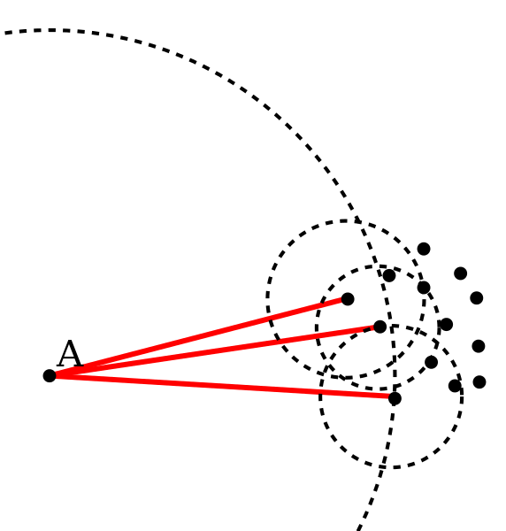

#Local Outlier Factor
The local outlier factor (LOF) method scores points in a multivariate dataset whose rows are assumed to be generated independently from the same probability 
distribution.

####Background
Local outlier factor is a density-based method that relies on nearest neighbors search. The LOF method scores each data point by computing the ratio of the average densities of the point's neighbors to the density of the point itself. According to the method, the estimated density of a point $$p$$ is the number of $$p$$'s neighbors divided by the sum of distances to the point's neighbors.

Suppose $$N(p)$$ is the set of neighbors of point $$p$$, $$k$$ is the number of points in this set, and $$d(p, x)$$ is the distance between points $$p$$ and $$x$$. The estimated density is:

$$
    \hat{f}(p) = \frac{k}{\sum_{x \in N(p)} d(p, x)}
$$

and the local outlier factor score is:

$$
    LOF(p) = \frac{\frac{1}{k} \sum_{x \in N(p)} \hat{f}(x)}{\hat{f}(p)}.
$$

<center>

</center>
*Point A has a high LOF score because its density is low relative to its
neighbors' densities. Dotted circles indicate the distance to each point's
third-nearest neighbor. Source: Wikipedia - Local outlier factor.
File:LOF-idea.svg. https://commons.wikimedia.org/wiki/File:LOF-idea.svg*

####Creating a Local Outlier Factor Model

To show how the LOF tool is used, we'll use the customer data from the [AirBnB New User Bookings competition](https://www.kaggle.com/c/airbnb-recruiting-new-user-bookings) on Kaggle. The following code assumes a copy of the file `train_users_2.csv` is saved in the working directory. Each row in this dataset describes one of 213,451 AirBnB users; there is a mix of basic features, such as gender, age, and preferred language, and the user's "technology profile", including the browser type, device type, and sign-up method.

First, we read the data into an [`SFrame`](https://dato.com/products/create/docs/generated/graphlab.SFrame.html), and select a subset of features of interest. For this illustration we'll use only the basic features: gender, age, and language.

```python
import graphlab as gl
users = gl.SFrame.read_csv('train_users_2.csv', header=True)

features = ['gender', 'age', 'language']
users = users[['id'] + features]
users.print_rows(5)
```
```no-highlight
+------------+-----------+------+----------+
|     id     |   gender  | age  | language |
+------------+-----------+------+----------+
| gxn3p5htnn | -unknown- | None |    en    |
| 820tgsjxq7 |    MALE   | 38.0 |    en    |
| 4ft3gnwmtx |   FEMALE  | 56.0 |    en    |
| bjjt8pjhuk |   FEMALE  | 42.0 |    en    |
| 87mebub9p4 | -unknown- | 41.0 |    en    |
+------------+-----------+------+----------+
[213451 rows x 4 columns]
```

We have a small amount of data cleaning to do. I peeked ahead and realized that several users have ages of 2013 or 2014 (presumably the year was recorded accidentally), so we will re-code those values as "missing". The LOF model does not allow missing data when the model is created, so we'll actually drop any row that has a missing value (these values could also be imputed for more thorough results). After dropping low-quality rows, we're down to about 125,000 users.

```python
users['age'] = users['age'].apply(lambda x: x if x < 150 else None)
users = users.dropna(columns=features, how='any')
print len(users)
```
```no-highlight
124681
```

By default the LOF tool measures the difference between string-typed features with Levenshtein distance, but this is fairly slow to compute. Instead, let's use the [`one-hot encoder`](https://dato.com/products/create/docs/generated/graphlab.toolkits.feature_engineering.OneHotEncoder.html) to turn the string features into categorical features. We'll also need to standardize the `age` feature so it's on roughly the same scale as the encoded categorical features.

```python
encoder = gl.feature_engineering.OneHotEncoder(features=['language', 'gender'])
users2 = encoder.fit_transform(users)
users2['age'] = (users['age'] - users['age'].mean()) / users['age'].std()
```

Finally, we create the LOF model and inspect the output anomaly scores by printing the model's `scores` field.

```python
model = gl.anomaly_detection.local_outlier_factor.create(users2,
                                           features=['age', 'encoded_features'])
model['scores'].print_rows(5)
```
```no-highlight
+--------+---------+---------------+---------------------+
| row_id | density | anomaly_score | neighborhood_radius |
+--------+---------+---------------+---------------------+
| 79732  |   inf   |      nan      |         0.0         |
|  7899  |   inf   |      nan      |         0.0         |
| 25263  |   inf   |      nan      |         0.0         |
| 87629  |   inf   |      nan      |         0.0         |
| 43116  |   inf   |      nan      |         0.0         |
+--------+---------+---------------+---------------------+
[124681 rows x 4 columns]
```

From the `scores` SFrame we can see that the model worked successfully, scoring each of the 124,681 input rows, but we still have a bit of work to do to understand the results and make a final determination about which points are anomalies.

Note that the anomaly score for many observations in our AirBnB dataset is `nan` which indicates the point has many neighbors at exactly the same location, making the ratio of densities undefined. These points are *not* outliers.

####Using the LOF Model to detect anomalies
There are two common ways to make a final decision about whether each point is typical or anomalous. The first is to simply declare the `k` points with the highest scores to be anomalous. The `topk` method of the `scores` SFrame is straightforward way to find this.

```python
anomalies = model['scores'].topk('anomaly_score', k=5)
anomalies.print_rows()
```
```no-highlight
+--------+---------------+---------------+---------------------+
| row_id |    density    | anomaly_score | neighborhood_radius |
+--------+---------------+---------------+---------------------+
| 119047 | 13.9548615034 |      inf      |   0.0716596148059   |
| 47886  | 13.9548615034 |      inf      |   0.0716596148059   |
| 91446  | 13.9548615034 |      inf      |   0.0716596148059   |
| 114118 | 13.9548615034 |      inf      |   0.0716596148059   |
| 21279  | 13.9548615034 |      inf      |   0.0716596148059   |
+--------+---------------+---------------+---------------------+
[5 rows x 4 columns]
```

The anomaly scores for these points are *infinite*, which happens when a point is next to several identical points, but is not itself a member of that bunch. These points are certainly anomalous, but our choice of `k` was arbitrary and excluded many points that are also likely anomalous.

A better way to get the anomalies is to find points whose anomaly score is above some *threshold*, which can be chosen by looking at the distribution of anomaly scores. The `sketch_summary` method let's us do this and find a threshold from an approximate *quantile*.

```python
sketch = model['scores']['anomaly_score'].sketch_summary()
threshold = sketch.quantile(0.9)
mask = model['scores']['anomaly_score'] > threshold
anomalies = model['scores'][mask]
print "threshold:", threshold, "\nnumber of anomalies:", len(anomalies)
```
```no-highlight
threshold: 8.6 
number of anomalies: 173
```

To see the original features for the anomalies, we filter our input dataset to select only the anomaly rows.

```python
users = users.add_row_number('row_id')
anomaly_users = users.filter_by(anomalies['row_id'], 'row_id')
anomaly_users.print_rows(20)
```
```no-highlight
+--------+------------+-----------+------+----------+
| row_id |     id     |   gender  | age  | language |
+--------+------------+-----------+------+----------+
|  787   | w6i3ix717s |   OTHER   | 36.0 |    en    |
|  4579  | rpgxhr7bp2 |    MALE   | 18.0 |    it    |
|  4749  | lnje5xn0iq |    MALE   | 21.0 |    es    |
|  5328  | eqsihtnz34 |   FEMALE  | 36.0 |    hu    |
|  6528  | dyu0sssqo5 | -unknown- | 47.0 |    nl    |
|  8228  | o1ciaivnyv |    MALE   | 41.0 |    es    |
|  8788  | 91vfcvol82 |    MALE   | 91.0 |    en    |
|  9317  | d24kga4mhu |   FEMALE  | 39.0 |    de    |
|  9472  | rqpt645tjk |   FEMALE  | 39.0 |    de    |
|  9626  | t6fvmrna0t |    MALE   | 98.0 |    en    |
| 10083  | n45ipduv9i |    MALE   | 28.0 |    fi    |
| 10727  | 9zhr7vpciy |    MALE   | 39.0 |    fr    |
| 10765  | lerui8bp4h |   FEMALE  | 88.0 |    en    |
| 11038  | h0cf46ubyt |    MALE   | 27.0 |    fi    |
| 12293  | unnvgq3efo |    MALE   | 40.0 |    pl    |
| 12952  | jkkz6g9y0l |   FEMALE  | 33.0 |    it    |
| 13926  | 1yoqktv6n6 |   OTHER   | 36.0 |    en    |
| 13980  | 2a9z5icq6y |    MALE   | 39.0 |    de    |
| 14044  | oyr9d8w1ig |   OTHER   | 39.0 |    en    |
| 15761  | i07vsn6wkm |   FEMALE  | 43.0 |    es    |
+--------+------------+-----------+------+----------+
[173 rows x 5 columns]
```

####References
- Breunig, M. M., Kriegel, H., Ng, R. T., & Sander, J. (2000).
[LOF: Identifying Density-Based Local Outliers](http://people.cs.vt.edu/badityap/classes/cs6604-Fall13/readings/breunig-2000.pdf). pp 1-12.
