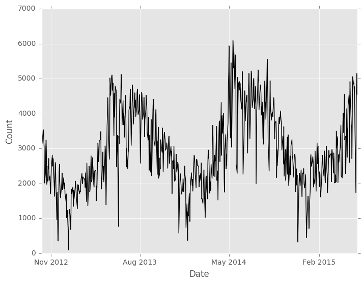
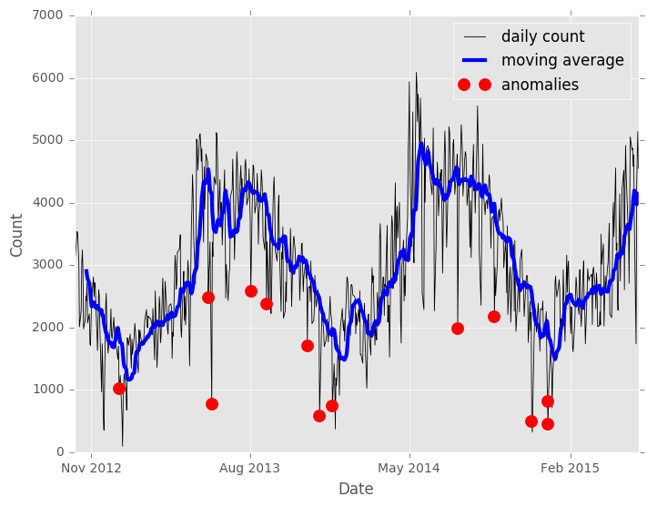
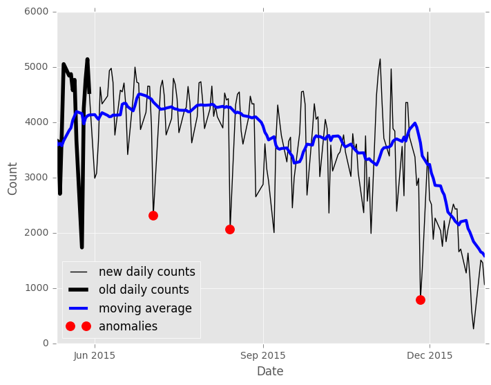

#Moving Z-Score
The [`Moving Z-score model`](https://dato.com/products/create/docs/generated/graphlab.toolkits.anomaly_detection.moving_zscore.create.html) scores anomalies in a univariate sequential dataset, often a time series.

#### Background
The moving Z-score is a very simple model for measuring the anomalousness of each point in a sequential dataset like a time series. Given a window size $$w$$, the moving Z-score is the number of standard deviations each observation is away from the mean, where the mean and standard deviation are computed *only* over the previous $$w$$ observations.

$$
    Z(x_i) = \frac{x_i - \bar{x}_i}{s_i}
$$

where the moving mean and moving standard deviation are

$$
    \bar{x}_i = \frac{1}{w} \sum_{j=i-w}^{i-1} x_j \\
    s_i = \sqrt{\frac{1}{w} \sum_{j=i-w}^{i-1} (x_j - \bar{x}_i)^2}
$$

For the first $$w$$ observations of the series, the moving Z-score is undefined because there aren't sufficient observations to estimate the mean and standard deviation. For the GraphLab Create tool, we take the absolute value of the moving Z-score, so that the anomaly score varies from 0 to infinity, with higher scores indicating a greater degree of anomalousness.

#### Data and context
The Fremont bridge in Seattle is a popular place for cyclists to cross between the southern and northern halves of the city (and happens to be right next to the Dato office!). A traffic counter records the number of bicycles that cross the bridge every hour, and [the data is posted on the Seattle data portal](https://data.seattle.gov/Transportation/Fremont-Bridge-Hourly-Bicycle-Counts-by-Month-Octo/65db-xm6k). We will use the GraphLab Create Moving Z-score model to look for anomalies in this time series data.

The data can be read directly into an SFrame from the Seattle data portal's URL (the file is about 800KB) Cycle traffic is actually counted separately on each side of the bridge, but we combine these counts into a single hourly total. As a last formatting step, we convert the dataset into a [`TimeSeries`](https://dato.com/products/create/docs/generated/graphlab.TimeSeries.html) by encoding the timestamp column as `datetime.datetime` type and setting that column as the index.

```python
# Set up
import datetime as dt
import graphlab  as gl

# Download data.
data_url = 'https://data.seattle.gov/api/views/65db-xm6k/rows.csv?accessType=DOWNLOAD'
hourly_counts = gl.SFrame.read_csv(data_url)

# Add the counts from each side of the bridge.
hourly_counts['count'] = (hourly_counts['Fremont Bridge West Sidewalk'] + 
                          hourly_counts['Fremont Bridge East Sidewalk'])

# Convert the SFrame to a TimeSeries object
hourly_counts['timestamp'] = (hourly_counts['Date']
                             .str_to_datetime(str_format='%m/%d/%Y %H:%M:%S %P'))
hourly_counts = gl.TimeSeries(hourly_counts[['timestamp', 'count']],
                              index='timestamp')
```

By using a moving window, the The Moving Z-score model adapts well to distributional drift, but it does not handle high-frequency seasonality well. In our bicycle traffic dataset we have seasonality by hour, by day of the week, and by season of the year. In particular, the counts are low during night hours, low on the weekends, and low in the winter. We use two strategies to deal with this: first, we sum the counts with the [`resample`](https://dato.com/products/create/docs/generated/graphlab.TimeSeries.resample.html#graphlab.TimeSeries.resample) method to get a daily traffic count; and second, we drop the weekend days entirely and focus only on weekday traffic.

```python
## Group by day
daily_counts = hourly_counts.resample(dt.timedelta(1),
                            downsample_method={'count': gl.aggregate.SUM('count')})

## Remove the weekend days
weekdays = daily_counts['timestamp'].split_datetime(column_name_prefix=None,
                                                    limit=['weekday'])
daily_counts['weekday'] = weekdays['weekday']
daily_counts = daily_counts.filter_by([5, 6], 'weekday', exclude=True)
```

Later in this chapter, we'll illustrate how Moving Z-Score models can be updated with new data. To make that more interesting, we set aside the last few months of data to use when we get to that chapter.

```python
## Split dataset into original and update sets.
traffic = daily_counts[daily_counts['timestamp'] < dt.datetime(2015, 06, 01)]
```

Our final dataset `traffic` has 693 daily bicycle traffic counts, from October 3, 2012 to May 29, 2015. The data is relatively noisy to the naked eye, but clearly has some long term seasonality.

```python
traffic.print_rows(5)
```
```no-highlight
+---------------------+-------+---------+
|      timestamp      | count | weekday |
+---------------------+-------+---------+
| 2012-10-03 00:00:00 |  3521 |    2    |
| 2012-10-04 00:00:00 |  3475 |    3    |
| 2012-10-05 00:00:00 |  3148 |    4    |
| 2012-10-08 00:00:00 |  3537 |    0    |
| 2012-10-09 00:00:00 |  3501 |    1    |
+---------------------+-------+---------+
[693 rows x 3 columns]
```



#### Basic Moving Z-Score Usage

The Moving Z-score model takes an `SFrame` or `TimeSeries` as input (`traffic` in this case), the name of the column that contains the series to model, and the number of observations in the moving window. For this analysis our feature is the the "count" column and we use a window 15 days, or three work-weeks.

```python
model = gl.anomaly_detection.moving_zscore.create(traffic, feature='count',
                                                  window_size=15)
```

The primary output of the Moving Z-score model is the `scores` field. This `TimeSeries` object contains the original series (`count`), original row index (`timestamp`), moving average, anomaly score, and the time the model was created (for model updating - see below). For the Moving Z-score model, the anomaly score is the absolute value of the moving Z-score. As with all GraphLab Create Anomaly Detection models, this score ranges from 0 to infinity, with higher scores indicating a greater degree of "anomalousness".

```python
scores = model['scores']
scores.print_rows(20, max_row_width=100, max_column_width=20)
```
```no-highlight
+---------------------+----------------+-------+----------------+---------------------+
|      timestamp      | anomaly_score  | count | moving_average |  model_update_time  |
+---------------------+----------------+-------+----------------+---------------------+
| 2012-10-03 00:00:00 |      None      |  3521 |      None      | 2016-01-11 15:41... |
| 2012-10-04 00:00:00 |      None      |  3475 |      None      | 2016-01-11 15:41... |
| 2012-10-05 00:00:00 |      None      |  3148 |      None      | 2016-01-11 15:41... |
| 2012-10-08 00:00:00 |      None      |  3537 |      None      | 2016-01-11 15:41... |
| 2012-10-09 00:00:00 |      None      |  3501 |      None      | 2016-01-11 15:41... |
| 2012-10-10 00:00:00 |      None      |  3235 |      None      | 2016-01-11 15:41... |
| 2012-10-11 00:00:00 |      None      |  3047 |      None      | 2016-01-11 15:41... |
| 2012-10-12 00:00:00 |      None      |  2011 |      None      | 2016-01-11 15:41... |
| 2012-10-15 00:00:00 |      None      |  2273 |      None      | 2016-01-11 15:41... |
| 2012-10-16 00:00:00 |      None      |  3036 |      None      | 2016-01-11 15:41... |
| 2012-10-17 00:00:00 |      None      |  3243 |      None      | 2016-01-11 15:41... |
| 2012-10-18 00:00:00 |      None      |  2923 |      None      | 2016-01-11 15:41... |
| 2012-10-19 00:00:00 |      None      |  1977 |      None      | 2016-01-11 15:41... |
| 2012-10-22 00:00:00 |      None      |  2129 |      None      | 2016-01-11 15:41... |
| 2012-10-23 00:00:00 |      None      |  2500 |      None      | 2016-01-11 15:41... |
| 2012-10-24 00:00:00 | 0.856815256628 |  2429 | 2903.73333333  | 2016-01-11 15:41... |
| 2012-10-25 00:00:00 | 0.218502117692 |  2713 | 2830.93333333  | 2016-01-11 15:41... |
| 2012-10-26 00:00:00 | 1.38148316083  |  2073 | 2780.13333333  | 2016-01-11 15:41... |
| 2012-10-29 00:00:00 | 0.926826997598 |  2217 | 2708.46666667  | 2016-01-11 15:41... |
| 2012-10-30 00:00:00 |  1.7933899856  |  1735 | 2620.46666667  | 2016-01-11 15:41... |
+---------------------+----------------+-------+----------------+---------------------+
[693 rows x 5 columns]
```

Note that the first 15 rows of the `scores` output don't have a moving average or Z-score. This is because the moving window does not have sufficient data for those observations. Also note that if the input dataset is an `SFrame` instead of a `TimeSeries`, the `scores` field is also an `SFrame`.

Typically the ultimate goal is to make a final binary decision whether each point is "typical" or "anomalous". A good way to do this is to look at the approximate distribution of the anomaly scores with the `SArray.sketch_summary` tool, then to get a threshold for the anomaly score with the sketch summary's `quantile` method. Here we declare the top two percent of the data to be anomalies.

```python
sketch = scores['anomaly_score'].sketch_summary()
threshold = sketch.quantile(0.98)
anomalies = scores[scores['anomaly_score'] > threshold]
anomalies.print_rows(3, max_row_width=100, max_column_width=20)
```
```no-highlight
+---------------------+---------------+-------+----------------+---------------------+
|      timestamp      | anomaly_score | count | moving_average |  model_update_time  |
+---------------------+---------------+-------+----------------+---------------------+
| 2012-12-19 00:00:00 |  4.2314953527 |  1020 | 1880.86666667  | 2016-01-11 15:41... |
| 2013-05-21 00:00:00 |  3.7626308199 |  2481 | 4535.33333333  | 2016-01-11 15:41... |
| 2013-05-27 00:00:00 | 3.91782937621 |  769  | 4130.06666667  | 2016-01-11 15:41... |
+---------------------+---------------+-------+----------------+---------------------+
[13 rows x 5 columns]
```

It's clear that some of the anomalies are associated with holidays, but others don't have an obvious explanation. It's certainly interesting that all of the anomalous days have *lower* counts than the moving average for those days. For this type of univariate data, it's very useful to plot the anomalies on the original series.



#### Updating the model with new data

The Moving Z-score is unique among GraphLab Create models in that a new model can be created by updating an existing model. This allows the new model to use the end of the existing model's series to compute moving Z-scores for the first few points in the new data (avoiding the 'None's at the beginning of our first model's output). For this analysis we'll use the 169 observations since June 1, 2015 as "new" data.

```python
new_traffic = daily_counts[daily_counts['timestamp'] >= dt.datetime(2015, 06, 01)]
new_model = model.update(new_traffic)
```

Creating a new model with the `update` method *does not change* the original model. The new model looks and smells just like our original model, but there are two small differences in the results. First there are no more missing values in the `scores` `TimeSeries`, because the moving window is filled from the previous model's data.

```python
new_scores = new_model['scores']
new_anomalies = new_scores[new_scores['anomaly_score'] > threshold]
new_scores.print_rows(3, max_row_width=100, max_column_width=20)
```
```no-highlight
+---------------------+-----------------+-------+----------------+---------------------+
|      timestamp      |  anomaly_score  | count | moving_average |  model_update_time  |
+---------------------+-----------------+-------+----------------+---------------------+
| 2015-05-11 00:00:00 | 0.0304807047151 |  3676 |     3650.8     | 2016-01-11 15:41... |
| 2015-05-12 00:00:00 | 0.0769604795962 |  3653 | 3592.13333333  | 2016-01-11 15:41... |
| 2015-05-13 00:00:00 |  1.16177184304  |  2707 | 3619.46666667  | 2016-01-11 15:41... |
+---------------------+-----------------+-------+----------------+---------------------+
[169 rows x 5 columns]
```

The second difference is that the `model_update_time` is no longer identical for each observation.

```python
print new_scores['model_update_time'].unique()
```
```no-highlight
[datetime.datetime(2016, 1, 11, 15, 41, 1, 777038),
 datetime.datetime(2016, 1, 11, 18, 2, 55, 151691)]
```

The new model's output contains the last `window_size` observations so we can see how the new Z-scores are computed, but these are marked with the original model creation time. We can use this time to separate the scores, so we can plot just the new data's anomalies.

```python
update_time = new_scores['model_update_time'][-1]
old_window = new_scores['model_update_time'] < update_time
old_scores = new_scores[old_window]
```



#### Further reading
Jake Vanderplas wrote [an in-depth analysis](https://jakevdp.github.io/blog/2014/06/10/is-seattle-really-seeing-an-uptick-in-cycling/) of the Fremont bridge bicycle traffic data. The goal of his analysis is not anomaly detection, but it is an excellent read. 