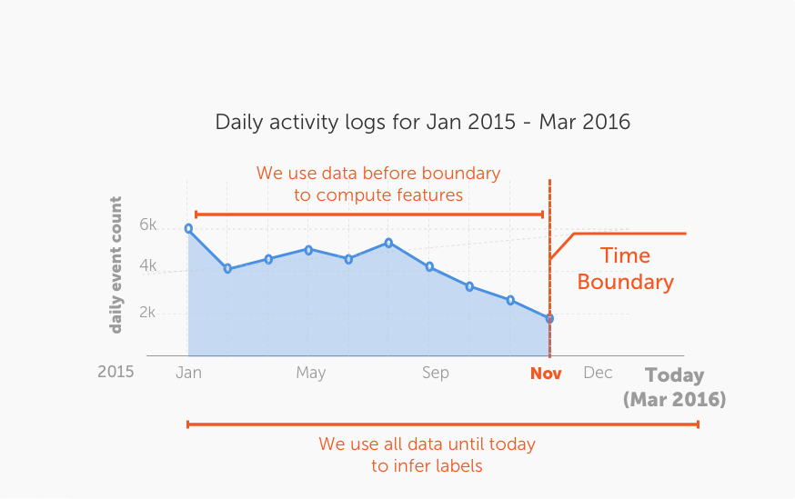

# How does this model work? 

There two stages during the model training phase:

- **Phase 1**: Feature engineering. In this phase, features are generated
   using the provided activity data. For this phase, only the data before
   the provided `time_boundary` is used. The data after the `time_boundary` is
   used to infer the prediction target (labels).
- **Phase 2**: Machine learning model training. In this phase, the computed features
  and the inferred labels are used to train a classifier model (using boosted
  trees).

#### Phase 1: Feature engineering

For **Phase 1**, this toolkit performs a series of extremely rich set of
feature transformations based on:
 - aggregate statistics (over various periods of time) of the raw input feature
   columns. 
 - patterns over various period of time (e.g. rate of change of aggregate
   usage). 
 - user metadata (using the `user_data` parameter),

The following table provides a description of all the engineered features used
in the model (T is a parameter that can be controlled using the parameter
`lookback_periods`). Hence, these features are computed for each value of `T`
in `lookback_periods`.

|                 Engineered features                                  | 
|----------------------------------------------------------------------|
| Average number of events in the last T days                          |
| Average value of a feature in the last T days                        |
| Largest daily value of a feature in the last T days                  |
| Largest time interval between two events in the last T days          |
| Number of days since the first event in the last T days              |
| Number of days since the most recent event in the last T days        |
| Number of days to the most recent event in the last T days           |
| Number of days with an event in the last T days                      |
| Number of days with an event in the last T days                      | 
| Number of events in the last T days                                  |
| Smallest daily value in the last T days                              |
| Smallest time interval between two events in the last T days         |
| Sum of a column in the last T days                                   |
| T day trend in the number of events                                  |
| Time interval between the first two events in the last T days        |
| Time interval between the two most recent events in the last T days  |

#### Phase 2: Model trianing 

For **Phase 2**, a classifier model is trained using gradient boosted trees.
Note that a churn prediction model can be trained without any labelled data.
All the target labels required for training the boosted tree model are inferred
based on the activity data from the past. For example, a dataset that contains
data from January 2011 to December 2011 contains historical information about
whether or or a user churned during each of the months prior to November 2011.

For a given `time_boundary` (say October 2011), all the events in
`observation_data` after October 2011 are not (and must never be) included in
the training data for the model. In order to create more training data for the
boosted tree classifier, multiple time-boundaries can be used (using the
parameter `time_boundaries`). 
