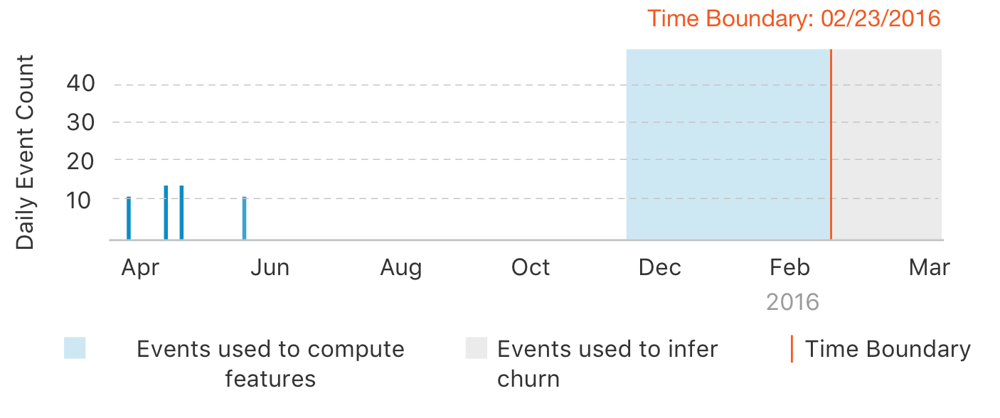

<script src="../turi/js/recview.js"></script>
# Churn prediction

Churn prediction is the task of identifying whether users are likely to stop
using a service, product, or website. With this toolkit, you can start with raw
(or processed) usage metrics and accurately forecast the probability that a
given customer will churn.

**Note**: Follow the steps in the [sample-churn-predictor](https://github.com/dato-code/sample-churn-predictor)
GitHub repo to get the code and data used in this chapter.

#### Introduction

A [`churn predictor
model`](https://turi.com/products/create/docs/generated/graphlab.toolkits.churn_predictor.create.html)
learns historical user behavior patterns to make an accurate forecast for the
probability of no activity in the future (defined as churn).

#### How is churn defined?

Customer churn can be defined in many ways. In this toolkit, churn is defined
to be **no activity** for a fixed period of time (called the `churn_period`).
Using this definition, a user is said to have churned if there is **no
activity** for a duration of time known as the `churn_period` (by default, this
is set to 30 days). The following figure better illustrates this concept.



A churn forecast is always associated with a particular timestamp (at which the
`churn_period` starts) known as a `time_boundary`.  As an example, a user is
said to have **churned** at the `time_boundary` Jan 2015 because the user did
not have any activity for a `churn_period` duration of time (say 30 days) after
Jan 2015.


#### Input Data

A churn prediction model can be trained on time-series of `observation_data`.
The time-series must contain a column to represent `user_id` and at least one
other column that can be treated as a feature column. The following example
shows a typical dataset that can be consumed directly by the churn predictor
toolkit.


```no-highlight
+---------------------+------------+----------+
|     InvoiceDate     | CustomerID | Quantity |
+---------------------+------------+----------+
| 2010-12-01 08:26:00 |   17850    |    6     |
| 2010-12-01 08:26:00 |   17850    |    6     |
| 2010-12-01 08:26:00 |   17850    |    8     |
| 2010-12-01 08:26:00 |   17850    |    6     |
| 2010-12-01 08:26:00 |   17850    |    6     |
| 2010-12-01 08:26:00 |   17850    |    2     |
| 2010-12-01 08:26:00 |   17850    |    6     |
| 2010-12-01 08:28:00 |   17850    |    6     |
| 2010-12-01 08:28:00 |   17850    |    6     |
| 2010-12-01 08:34:00 |   13047    |    32    |
| 2010-12-01 08:34:00 |   13047    |    6     |
| 2010-12-01 08:34:00 |   13047    |    6     |
| 2010-12-01 08:34:00 |   13047    |    8     |
| 2010-12-01 08:34:00 |   13047    |    6     |
| 2010-12-01 08:34:00 |   13047    |    6     |
| 2010-12-01 08:34:00 |   13047    |    3     |
| 2010-12-01 08:34:00 |   13047    |    2     |
| 2010-12-01 08:34:00 |   13047    |    3     |
| 2010-12-01 08:34:00 |   13047    |    3     |
| 2010-12-01 08:34:00 |   13047    |    4     |
+---------------------+------------+----------+
[532618 rows x 5 columns]
```

In the above dataset, let us assume that the last timestamp was October 1,
2011. If the `churn_period` is set to 1 month, a churn forecast predicts the
probability that a user will have no activity for a 1 month period after
October 1, 2011.


#### Example

In this example, we will explore the task of predicting churn directly from
customer activity logs. The following
[dataset](http://archive.ics.uci.edu/ml/datasets/Online+Retail) contains
transactions occurring between 01/12/2010 and 09/12/2011 for a UK-based and
registered non-store online retail.


```python
import graphlab as gl
import datetime

# Load a data set.
sf = gl.SFrame(
   'http://static.turi.com/datasets/churn-prediction/online_retail.csv')

# Convert InvoiceDate from string to a Python datetime.
import dateutil
from dateutil import parser
sf['InvoiceDate'] = sf['InvoiceDate'].apply(parser.parse)

# Convert the SFrame into TimeSeries with InvoiceDate as the index.
time_series = gl.TimeSeries(sf, 'InvoiceDate')


# Split the data using the special train, validation split.
train, valid = gl.churn_predictor.random_split(time_series,
                              user_id='CustomerID', fraction=0.9)

# Define the period of in-activity that constitutes churn.
churn_period = datetime.timedelta(days = 30)

# Train a churn prediction model.
model = gl.churn_predictor.create(train, user_id='CustomerID',
                      features = ['Quantity'],
                      churn_period = churn_period)

# Making a churn forecast
predictions = model.predict(time_series)

# Evaluating the model
evaluation_time = datetime.datetime(2011, 9, 1)
predictions = model.predict(time_series, evaluation_time)

# Visualize the results
views = model.views.overview(time_series, evaluation_time)
views.show()
```

#### Learn more

The following sections provide more information about the churn prediction model:
- [Using a trained model](using-a-trained-model.md)
- [Alternate input formats](alternate-input-formats.md)
- [How it works](how-it-works.md)
