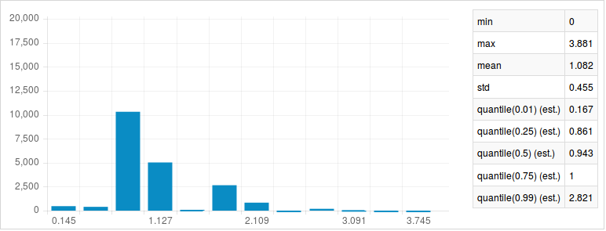

# Record linker
The record linker tool matches structured query records to a fixed set of
reference records with the same schema. A common example of this is matching
address records from a query dataset to a relatively error-free reference
address database.

To illustrate this example with the record linker tool, we use synthetic address
data generated by and packaged with the
[FEBRL](http://sourceforge.net/projects/febrl/) program, another data matching
tool. For the sake of illustration suppose the set called "refs" is a clean set
of reference addresses (say, from a government collected and curated database),
while the SFrame called "query" contains new data with many errors.

```python
import os
import graphlab as gl

col_types = {'street_number': str, 'postcode': str}

if os.path.exists('febrl_F_org_5000.csv'):
    refs = gl.SFrame.read_csv('febrl_F_org_5000.csv',
                              column_type_hints=col_types)
else:
    url = 'http://s3.amazonaws.com/dato-datasets/febrl_synthetic/febrl_F_org_5000.csv'
    refs = gl.SFrame.read_csv(url, column_type_hints=col_types)
    refs.save('febrl_F_org_5000.csv')

if os.path.exists('febrl_F_dup_5000.csv'):
    query = gl.SFrame.read_csv('febrl_F_dup_5000.csv',
                               column_type_hints=col_types)
else:
    url = 'http://s3.amazonaws.com/dato-datasets/febrl_synthetic/febrl_F_dup_5000.csv'
    query = gl.SFrame.read_csv(url, column_type_hints=col_types)
    query.save('febrl_F_dup_5000.csv')
```

For simplicity, we'll discard several of the features right off the bat. The
remaining features have the same schema in both the `refs` and `query` SFrames.
Note the large number of errors present even in the first few rows of the query
dataset.

```python
address_features = ['street_number', 'address_1', 'suburb', 'state', 'postcode']
refs = refs[address_features]
query = query[address_features]

refs.head(5)
```
```no-highlight
+---------------+---------------------+---------------+-------+----------+
| street_number |      address_1      |     suburb    | state | postcode |
+---------------+---------------------+---------------+-------+----------+
|       95      |     galway place    |    st marys   |       |   2681   |
|       12      |    burnie street    |   wycheproof  |  nsw  |   2234   |
|       16      | macrobertson street |    branxton   |  qld  |   3073   |
|      170      |    bonrook street   | brighton east |  nsw  |   3087   |
|       32      |   proserpine court  |   helensvale  |  qld  |   2067   |
+---------------+---------------------+---------------+-------+----------+
[5 rows x 5 columns]
```

```python
query.head(5)
```
```no-higlight
+---------------+-----------------+-------------------+-------+----------+
| street_number |    address_1    |       suburb      | state | postcode |
+---------------+-----------------+-------------------+-------+----------+
|       31      |                 |     reseevoir     |  qld  |   5265   |
|      329      |                 | smithfield plains |  vic  |   5044   |
|       37      | kelleway avenue |     burwooast     |  nsw  |   2770   |
|       15      |  mawalan street |     kallangur     |  nss  |   2506   |
|      380      |   davisktrdet   |    boyne ilsand   |  nss  |   6059   |
+---------------+-----------------+-------------------+-------+----------+
[5 rows x 5 columns]
```

#### Basic usage

The record linker model is somewhat smart about what feature transformations are
needed to accommodate the specified distance (although note that the street
number and postcode fields had to be forced to strings when the datasets were
imported). For our first pass, we'll use Jaccard distance, which implicitly
concatenates all features (as strings), then converts them to character n-grams
(a.k.a. shingles). In our experience, this is a good strategy for obtaining
reasonable first results from address features.

```python
model = gl.record_linker.create(refs, features=address_features,
                                distance='jaccard')
model.summary()
```
```no-highlight
Class                               : RecordLinker

Schema
------
Number of examples                  : 3000
Number of feature columns           : 5
Number of distance components       : 1
Method                              : brute_force

Training
--------
Total training time (seconds)       : 2.7403
```

Results are obtained with the model's **link** method, which matches a new set
of queries to the reference data passed in above to the `create` function. For
our first pass, we set the `radius` parameter to 0.5, which means that matches
must share at least roughly 50% of the information contained in both the
reference and query records.

```python
matches = model.link(query, k=None, radius=0.5)
matches.head(5)
```
```no-higlight
+-------------+-----------------+-----------------+------+
| query_label | reference_label |     distance    | rank |
+-------------+-----------------+-----------------+------+
|      1      |       2438      |  0.41935483871  |  1   |
|      1      |       533       |       0.5       |  2   |
|      2      |       688       |  0.192307692308 |  1   |
|      3      |       2947      | 0.0454545454545 |  1   |
|      5      |       1705      |  0.047619047619 |  1   |
+-------------+-----------------+-----------------+------+
[5 rows x 4 columns]
```

The results mean that the address in `query` row 1 match the address in `refs`
row number 2438, although the Jaccard distance is relatively high at 0.42.
Inspecting these records manually we see this is in fact *not* a good match.

```python
print query[1], '\n'
print refs[2438]
```
```no-higlight
{'suburb': 'smithfield plains', 'state': 'vic', 'address_1': '',
'street_number': '329', 'postcode': '5044'}

{'suburb': 'smithfield plains', 'state': 'vic', 'address_1': 'sculptor street',
'street_number': '16', 'postcode': '5044'}
```

On the other hand, the match between query number 3 and reference number 2947
has a distance of 0.045, indicating these two records are far more similar. By
pulling these records we confirm this to be the case.

```python
print query[3], '\n'
print refs[2947]
```
```no-higlight
{'suburb': 'kallangur', 'state': 'nss', 'address_1': 'mawalan street',
'street_number': '15', 'postcode': '2506'}

{'suburb': 'kallangur', 'state': 'nsw', 'address_1': 'mawalan street',
'street_number': '12', 'postcode': '2506'}
```

##### Defining a composite distance

Unfortunately, these records are **still** not a true match because the street
numbers are different (in a way that is not likely to be a typo). Ideally we
would like street number differences to be weighted heavily in our distance
function, while still allowing for typos and misspellings in the street and city
names. To do this we can build a **composite distance** function.

A **composite distance** is simply a weighted sum of standard distance
functions, specified as a list. Each element of the list contains three things:

  1. a list or tuple of feature names,
  2. a standard distance name, and
  3. a multiplier for the standard distance.

Please see the documentation for the [GraphLab Create distances
module](https://dato.com/products/create/docs/graphlab.toolkits.distances.html)
for more on composite distances.

In this case we'll use Levenshtein distance to measure the dissimilarity in
street number, in addition to our existing Jaccard distance measured over all of
the address features. Both of these components will be given equal weight. In
the summary of the created model, we see the number of distance components is
now two---Levenshtein and Jaccard distances---instead of one in our first model.

```python
address_dist = [
                [['street_number'], 'levenshtein', 1],
                [address_features, 'jaccard', 1]
               ]

model = gl.record_linker.create(refs, distance=address_dist)
model.summary()
```
```no-higlight
Class                               : RecordLinker

Schema
------
Number of examples                  : 3000
Number of feature columns           : 5
Number of distance components       : 2
Method                              : brute_force

Training
--------
Total training time (seconds)       : 0.4789
```

One tricky aspect of using a composite distance is figuring out the best
threshold for match quality. A simple way to do this is to first return a
relatively high number of matches for each query, then look at the distribution
of distances for good thresholds using the `radius` parameter.

```python
pre_match = model.link(query, k=10)
pre_match['distance'].show()
```


In this distribution we see a stark jump at 0.636 in the distribution of
distances for the 10-nearest neighbors of every query (remember this is no
longer simple Jaccard distance, but a sum of Jaccard and Levenshtein distances
over different sets of features). In our final pass, we set the `k` parameter to
None, but enforce this distance threshold with the `radius` parameter.

```python
matches = model.link(query, k=None, radius=0.64)
matches.head(5)
```
```no-highlight
+-------------+-----------------+----------------+------+
| query_label | reference_label |    distance    | rank |
+-------------+-----------------+----------------+------+
|      6      |       1266      | 0.333333333333 |  1   |
|      7      |       2377      | 0.208333333333 |  1   |
|      9      |       2804      | 0.575757575758 |  1   |
|      12     |       2208      | 0.181818181818 |  1   |
|      13     |       1346      | 0.111111111111 |  1   |
+-------------+-----------------+----------------+------+
[5 rows x 4 columns]
```

There are far fewer results now, but they are much more likely to be true
matches than with our first model, even while allowing for typos in many of the
address fields.

```python
print query[6], '\n'
print refs[1266]
```
```no-higlight
{'suburb': 'clayton south', 'state': '', 'address_1': 'ingham oace',
'street_number': '128', 'postcode': '7520'}

{'suburb': 'clayton south', 'state': 'nsw', 'address_1': 'ingham place',
'street_number': '128', 'postcode': '7052'}
```

#### References

- Febrl - A Freely Available Record Linkage System with a Graphical User
  Interface. Peter Christen. Proceedings of the ‘Australasian Workshop on Health
  Data and Knowledge Management’ (HDKM). Conferences in Research and Practice in
  Information Technology (CRPIT), vol. 80. Wollongong, Australia, January 2008.