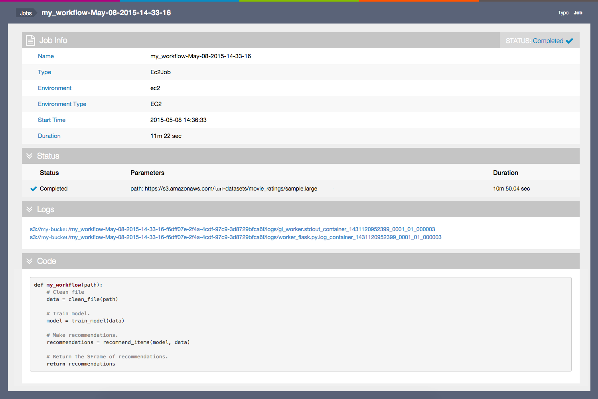

# Monitoring Jobs

Jobs are designed to be asynchronous objects. Once they are created (using the
`create()` function), you can manage their execution status using the
`get_status()` and `cancel()` methods.

##### Status

To get the current status of a job:

```python
job.get_status()
```
```
'Running'
```

[job.get_status()](https://dato.com/products/create/docs/generated/graphlab.deploy.Job.get_status.html)
will return one of the following messages: 'Pending', 'Running', 'Completed',
'Failed', 'Unknown', 'Canceled'.

##### Start and End time

To get the start time of this job:

```python
job.get_start_time()
```
```
datetime.datetime(2015, 5, 8, 14, 36, 33)
```

To get the end time of this job:

```python
job.get_end_time()
```
```
datetime.datetime(2015, 5, 8, 14, 47, 55)
```

Both [job.get_start_time()](https://dato.com/products/create/docs/generated/graphlab.deploy.Job.get_start_time.html)
and [job.get_end_time()](https://dato.com/products/create/docs/generated/graphlab.deploy.Job.get_end_time.html)
return a Python [DateTime](https://docs.python.org/2/library/datetime.html) object.

##### Metrics

To get more information about this job, such as why this job failed, or why one of the
executions for a set of parameters failed, we look at the job metrics.

```python
print job.get_metrics()
```
```
+-------------+-----------+---------------------+---------------+-----------+
|  task_name  |   status  |      start_time     |    run_time   | exception |
+-------------+-----------+---------------------+---------------+-----------+
| my_workflow | Completed | 2015-05-08 14:36:38 | 650.040112972 |    None   |
+-------------+-----------+---------------------+---------------+-----------+
+-------------------+---------------------+
| exception_message | exception_traceback |
+-------------------+---------------------+
|        None       |         None        |
+-------------------+---------------------+
[1 rows x 7 columns]
```
The metrics [SFrame](https://dato.com/products/create/docs/generated/graphlab.SFrame.html)
contains the status, start time, and run time of each execution. We can also
find out the exception type, message, and traceback if the execution fails.

Another way to retrieve more details about job execution errors in Hadoop is ``job.get_error()``:

```python
job.get_error()
```
```
'Failed to install user-specified package.'
```

##### Logs

To get the log file path for this execution, simply call
[job.get_log_file_path()](https://dato.com/products/create/docs/generated/graphlab.deploy.Job.get_log_file_path.html). This works for both EC2 (S3 path) and Hadoop (HDFS path).

```python
job.get_log_file_path()
```
```
's3://dato-kaggle/my_workflow-May-08-2015-14-33-16-f6dff07e-2f4a-4cdf-97c9-3d8729bfca6f/logs'
```

##### Cancel

You can cancel a job by calling
[job.cancel()](https://dato.com/products/create/docs/generated/graphlab.deploy.Job.cancel.html).

```python
job.cancel()
```

##### Results

To get results of a job execution, we can use [``job.get_results()``](https://dato.com/products/create/docs/generated/graphlab.deploy.Job.get_results.html).

For distributed jobs, we can use [``job.get_map_results()``](https://dato.com/products/create/docs/generated/graphlab.deploy.Job.get_map_results.html) to get the result of each execution. If the distributed job has a combiner function, we can obtain the
combiner function result from [job.get_results()](https://dato.com/products/create/docs/generated/graphlab.deploy.Job.get_results.html).

##### Visualize Job

To visualize a Job, call [show()](https://dato.com/products/create/docs/generated/graphlab.deploy.Job.show.html) method:

```
job.show()
```

[](images/job-visualization.png)

##### More

To get more information about a Job, simply print it. This provides general information about the job, including what parameters are being used, the name of the job, and execution-related information will be printed.

For example, 

```python
print job
```
```
Info
------
Job                : my_workflow-May-08-2015-14-33-16
Environment        : EC2: ["name": ec2, "access_key": ..., "instance_type": m3.xlarge, "region": us-west-2, "num_hosts": 1, "s3 folder": s3://dato-kaggle, "params": {}]
Function(s)        : ['my_workflow']
Status             : Completed

Help
------
Visualize progress : self.show()
Query status       : self.get_status()
Get results        : self.get_results()

Metrics
-------
Start time         : 2015-05-08 14:36:33
End time           : 2015-05-08 14:47:55
+-------------+-----------+---------------------+---------------+-----------+
|  task_name  |   status  |      start_time     |    run_time   | exception |
+-------------+-----------+---------------------+---------------+-----------+
| my_workflow | Completed | 2015-05-08 14:36:38 | 650.040112972 |    None   |
+-------------+-----------+---------------------+---------------+-----------+
+-------------------+---------------------+
| exception_message | exception_traceback |
+-------------------+---------------------+
|        None       |         None        |
+-------------------+---------------------+
[1 rows x 7 columns]


Execution Information:

  EC2 Environment name: ec2
  S3 Folder: s3://dato-kaggle
```
