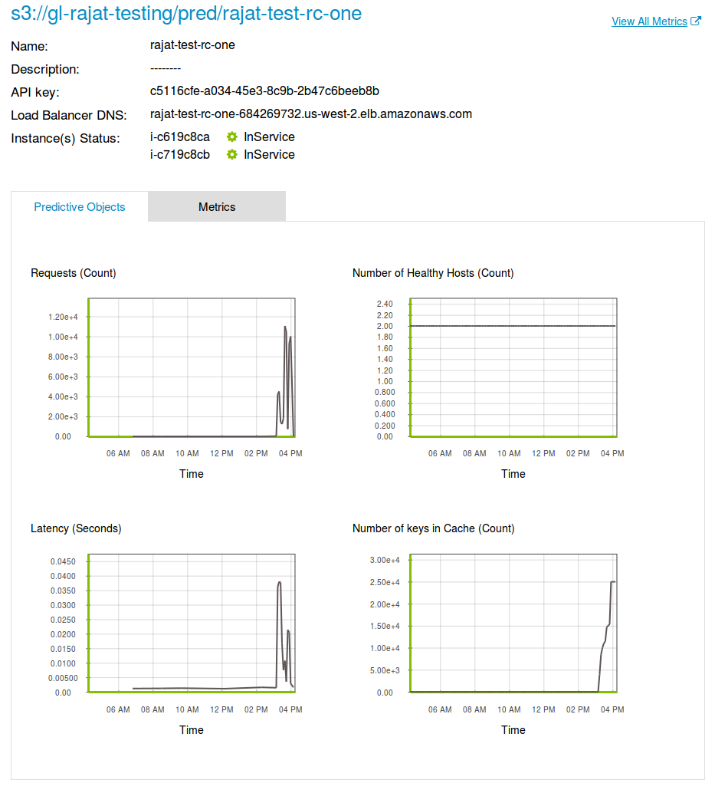

# Introduction to Predictive Services

Dato Predictive Services enable straightforward deployment of machine learning models as reliable and scalable web services for easy integration into predictive applications using a low-latency REST API. With one command, launch a cluster, deploy a model, update a model (with no downtime), or capture interaction data to improve the next version of the model. Here are some of the highlights of Dato Predictive Services:

- Deploy trained GraphLab Create models into a elastic web service with a single line of code.
- Incorporate business logic with the ability to deploy arbitrary python code.
- Scale up/down the number of nodes in the web service based on needs.
- Easily update or switch the deployed models without any downtime.
- Monitor, manage, and gather feedback from the service to help improve models.
- Run experiments with multiple models.
- GraphLab predictive services come fully equipped with load balancers, caching layers,
  and many other functionalities that make it suitable for live deployments.

The following chapters walk through an end-to-end Predictive Services example, then elaborate on specific aspects:

**Getting Started** walks through a basic end-to-end scenario.

**Launching a Predictive Service** describes how the service is configured and deployed; moreover it includes guidelines to ensure the service is secure.

**Querying** shows the different methods of querying a deployed Predictive Object, as well as how to consume the result of a query.

**Predictive Objects** talks about the type of models and custom objects a Predictive Service can host and serve, and how to manage the lifecycle of such objects.

**Logging and Feedback** contains information about how to access a service's logs and how to submit feedback for a query result.

**Dependencies** shows ways to add dependent packages or custom files to be accessible by the predictive service.

**Experimentation** explains how to handle multiple models within the same scenario, including the definition of policies to serve them behind a single endpoint.

**Operations** provides further details about monitoring and management of the Predictive Service.

**Run Locally** describes how to install and run a Predictive Service locally on-premises.
