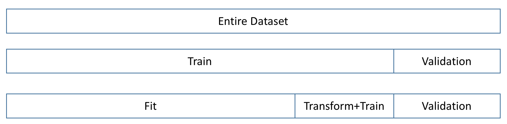

<script src="../turi/js/recview.js"></script>
#Count Featurizer

The Count Featurizer (Also, called Learning With Counts, or Dracula
https://blogs.technet.microsoft.com/machinelearning/2015/02/17/big-learning-made-easy-with-counts/ )
allows you to convert complex categorical dimensions to
simpler scalar dimensions which are easier and faster to train on while 
improving classification performance.

The Count Featurizer is unlike most of the other feature engineering methods in that, it is designed
specifically for classification, and requires some care to use correctly.
* The count featurizer requires a target prediction column to be provided.
* You should perform fit and transform on different datasets to avoid 
overfitting (See Usage Tips below).

Formally, given a target column Y we are trying to predict with k classes (1...k),
it replaces every categorical column X with 2 columns:

**count_X** : a list of the following values
*  \#(Y = 1 & X = x_i) : the number of times Y = 1 when X has the value x_i
*  \#(Y = 2 & X = x_i) : the number of times Y = 2 when X has the value x_i
*  \#(Y = 3 & X = x_i) : the number of times Y = 3 when X has the value x_i
*  ...
*  \#(Y = k & X = x_i): the number of times Y = k when X has the value x_i

**prob_X** : a list of the following values
*  P(Y = 1 | X = x_i) : the probability Y = 1 when X has the value x_i
*  P(Y = 2 | X = x_i) : the probability Y = 2 when X has the value x_i
*  P(Y = 3 | X = x_i) : the probability Y = 3 when X has the value x_i
*  ...
*  P(Y = k-1 | X = x_i) : the probability Y = k-1 when X has the value x_i

The input categorical columns must of type **string** or **int** and the 
target prediction column must also be of type **string** or **int**.

#### Usage

```python
import graphlab
from graphlab.toolkits.feature_engineering import *

# Create data.
sf=graphlab.SFrame({'state':[0,1,0,3,2,2],
                    'gender':['M','F','M','M','F','F'], 
                    'click':[1,1,0,1,1,1]})

# Split the data
sf_fit = sf[:4]
sf_train = sf[4:]

# Create a transformer.
countfeat = graphlab.feature_engineering.create(sf_fit, 
               CountFeaturizer(target='click'))

# Transform the train set. This is the dataset I will train my classifier on
transformed_sf_train = countfeat.transform(sf_train)

# Save the transformer.
countfeat.save('save-path')

sf_train
transformed_sf_train
```

```no-highlights
Columns:
	click	int
	gender	str
	state	int

Rows: 2

Data:
+-------+--------+-------+
| click | gender | state |
+-------+--------+-------+
|   1   |   F    |   2   |
|   1   |   F    |   2   |
+-------+--------+-------+
[2 rows x 3 columns]

Columns:
	count_gender	array
	prob_gender	array
	count_state	array
	prob_state	array
	click	int

Rows: 2

Data:
+--------------+-------------+-------------+------------+-------+
| count_gender | prob_gender | count_state | prob_state | click |
+--------------+-------------+-------------+------------+-------+
|  [0.0, 1.0]  |    [0.0]    |  [0.0, 0.0] |   [0.0]    |   1   |
|  [0.0, 1.0]  |    [0.0]    |  [0.0, 0.0] |   [0.0]    |   1   |
+--------------+-------------+-------------+------------+-------+
[2 rows x 5 columns]
```

#### Usage Tips
Since the Count Featurizer internally learns something similar to a Naive Bayes
classifier you should perform fit and transform on different datasets to avoid 
overfitting. 



Furthermore, if your data has a temporal component to it (for instance log data
for click through prediction), you should not perform a random split, but
perform the split temporally: the fit dataset should be the
oldest, the validation should be the newest, and the training set in between.

