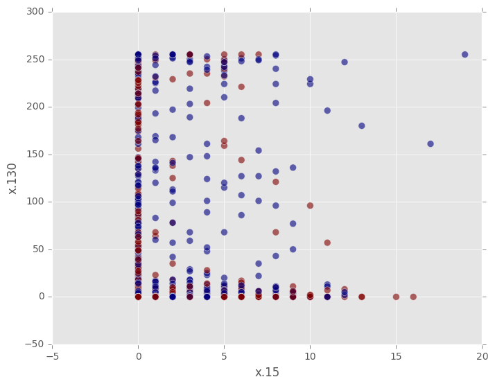
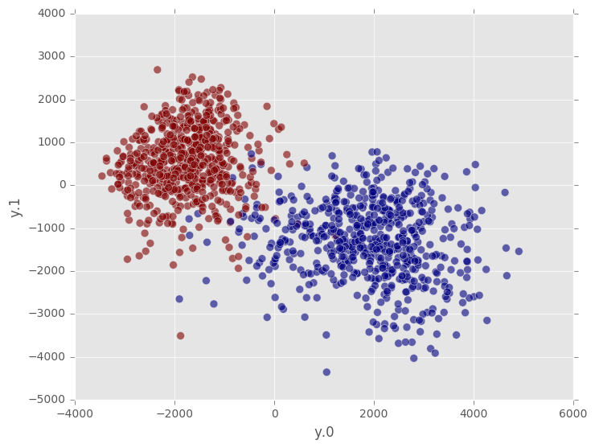

#Random Projection

Random projection is a tool for representing high-dimensional data in a low-dimensional feature space, typically for data visualization or methods that rely on fast computation of pairwise distances, like nearest neighbors searching and nonparametric clustering.

#### Introduction

Dimension reduction is a very useful preprocessing step for several tasks:

1. **Data visualization**. For data with more than three features (four or five if we're really clever, e.g. [Gapminder](http://www.gapminder.org/videos/)), it's impossible to plot in the original feature space. Dimension reduction gives us a two-dimension representation of the data that can be easily plotted.

2. **Analyzing high-dimensional data**. The curse of dimensionality makes it difficult to tell when high-dimensional data points are similar to each other or not. This is a particularly acute problem for nearest neighbors search and nonparametric clustering, where random projection is often a standard preprocessing step.

3. **Storing and moving large datasets**. Dimension reduction allows us to reduce the size of datasets without discarding any data points, as we would have to do with other techniques like vector quantization or locality-sensitive hashing.

GraphLab Create's [RandomProjection](https://dato.com/products/create/docs/generated/graphlab.toolkits.feature_engineering.RandomProjection.html) tool uses **Gaussian random projection**. Let's say we have a numeric dataset with $$n$$ examples, each of which is represented by $$d$$ features (where $$d$$ is presumably relatively large, maybe on the order of hundreds or thousands). In other words, our data is a matrix $$X$$, with $$n$$ rows and $$d$$ columns. Suppose we want to reduce the dimensionality of our data so that each example is represented by only $$k$$ features, where $$k$$ is small, like 2 or 10.

For Gaussian random projection we construct a projection matrix $$R$$ with $$d$$ rows and $$k$$ columns. Each entry is independently sampled from a standard Gaussian distribution

$$
    R_{ij} \sim N(0, 1)
$$

The projection is done by multiplying our data matrix by the projection matrix:

$$
    Y = \frac{1}{\sqrt{k}}XR
$$

so that our output dataset $$Y$$ has $$n$$ rows with only $$k$$ columns. The scalar $$1/\sqrt{k}$$ ensures that the Euclidean distance between any two points in the new low-dimensional space is very close to the distance between the same points in the original high-dimensional space, with high probability.

#### Usage

To illustrate usage of the similarity search toolkit, we use a small subset of the [MNIST handwritten digits image dataset](https://en.wikipedia.org/wiki/MNIST_database), which can be downloaded from the public Dato datasets bucket on Amazon S3. The download is about 1.5 MB.

```python
import graphlab as gl
import os

if os.path.exists('mnist_train6k'):
    mnist = gl.SFrame('mnist_train6k')
else:
    mnist = gl.SFrame('http://s3.amazonaws.com/dato-datasets/mnist/sframe/train6k')
    mnist.save('mnist_train6k')
```

The first preprocessing step is to convert the image data to an array of floats. Each array has 784 entries.

```python
import array
mnist['array'] = mnist['image'].astype(array.array)
mnist.print_rows(5)

print "Number of features:", len(mnist['array'][0])
```
```no-highlight
+-------+----------------------+-------------------------------+
| label |        image         |             array             |
+-------+----------------------+-------------------------------+
|   5   | Height: 28 Width: 28 | [0.0, 0.0, 0.0, 0.0, 0.0, ... |
|   8   | Height: 28 Width: 28 | [0.0, 0.0, 0.0, 0.0, 0.0, ... |
|   1   | Height: 28 Width: 28 | [0.0, 0.0, 0.0, 0.0, 0.0, ... |
|   4   | Height: 28 Width: 28 | [0.0, 0.0, 0.0, 0.0, 0.0, ... |
|   2   | Height: 28 Width: 28 | [0.0, 0.0, 0.0, 0.0, 0.0, ... |
+-------+----------------------+-------------------------------+
[6000 rows x 3 columns]

Number of features: 784
```

With 784 features, this dataset is impossible to plot. A naive thing to try is to pick two features arbitrarily to plot, but even when we limit the plot to just two of the 10 classes, the result is useless. We cannot distinguish the distributions visually.

```python
import matplotlib.pyplot as plt
plt.style.use('ggplot')

mnist_temp = mnist.unpack('array', column_name_prefix='x')
mnist_temp = mnist_temp.filter_by([0, 1], 'label')

fig, ax = plt.subplots()
ax.scatter(mnist_temp['x.15'], mnist_temp['x.130'], c=mnist_temp['label'],
           s=50, alpha=0.6)
ax.set_xlabel('x.15'); ax.set_ylabel('x.130')
fig.show()
```



However, if we apply a random projection to 2 dimension, then plot the two classes, we can see that the classes remain separated in the low-dimension space. Note that we do not need to unpack the data manually; the `RandomProjection` transformer takes care of that for us.

```python
from graphlab.toolkits.feature_engineering import RandomProjection

rp = RandomProjection(features=['array'], embedding_dimension=2,
                      output_column_prefix='y', random_seed=19)

mnist_embedded = rp.fit_transform(mnist)
mnist_embedded = mnist_embedded.filter_by([0, 1], 'label')

fig, ax = plt.subplots()
ax.scatter(mnist_embedded['y.0'], mnist_embedded['y.1'], c=mnist_embedded['label'], 
           s=50, alpha=0.6)
ax.set_xlabel('y.0'); ax.set_ylabel('y.1')
fig.show()
```



The `summary` method of a fitted `RandomProjection` object is useful for understanding how many features the transformer expects to receive for calls to `transform`, as well as the random seed for construction of the projection matrix. Two `RandomProjection` instances with the same random seed yield the same output point for the same input data.

```python
rp.summary()
```
```no-highlight
Class                         : RandomProjection

Model fields
------------
Embedding dimension           : 2
Original dimension            : 784
Features                      : ['array']
Excluded features             : None
Unpacked features             : [array[0], array[1], array[2], ... array[783]] (total 784 features)
Output column prefix          : y
Random seed                   : 19
Has been fitted               : 1
```

#### References

- Achlioptas, D. (2003). [Database-friendly random projections: Johnson-Lindenstrauss with binary coins (https://users.soe.ucsc.edu/~optas/papers/jl.pdf). Journal of Computer and System Sciences, 66(4).

- Li, P., Hastie, T. J., & Church, K. W. (2006). [Very sparse random projections](http://web.stanford.edu/~hastie/Papers/Ping/KDD06_rp.pdf). Proceedings of the 12th ACM SIGKDD International Conference on Knowledge Discovery and Data Mining - KDD ’06.

- Wikipedia. [Dimensionality reduction](https://en.wikipedia.org/wiki/Dimensionality_reduction).

- Wikipedia. [Random projection](https://en.wikipedia.org/wiki/Random_projection).
