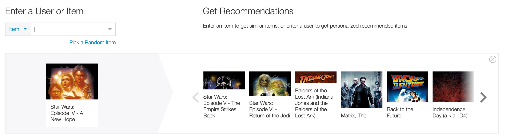

# Using trained models

All recommender objects in the [graphlab.recommender](https://dato.com/products/create/docs/graphlab.toolkits.recommender.html) module expose a common set of methods, such as [recommend](https://dato.com/products/create/docs/generated/graphlab.recommender.factorization_recommender.FactorizationRecommender.recommend.html#graphlab.recommender.factorization_recommender.FactorizationRecommender.recommend)
and [evaluate](https://dato.com/products/create/docs/generated/graphlab.recommender.factorization_recommender.FactorizationRecommender.evaluate.html).

In this section we will cover

- [Making recommendations](#making-recommendations)
- [Finding similar items](#finding-similar-items)
- [Visualizations](#visualizations)
- [Saving and loading](#saving-and-loading-models)

##### Making recommendations

The trained model can now make recommendations of new items for users.
To do so, call `model.recommend()` with an SArray of user ids.  If `users`
is set to None, then `model.recommend()` will make recommendations for all
the users seen during training, automatically excluding the items that
are observed for each user.  In other words, if `data` contains a row
"Alice, The Great Gatsby", then `model.recommend()` will not recommend "The
Great Gatsby" for user "Alice".  It will return at most `k` new items
for each user, sorted by their rank.  It will return fewer than `k`
items if there are not enough items that the user has not already
rated or seen.

The `score` column of the output contains the *unnormalized*
prediction scores for each user-item pair.  The semantic meanings of
these scores may differ between models.  For the linear regression
model, for instance, a higher average score for a user means that the
model thinks that this user is generally more enthusiastic than
others.

##### Finding Similar Items

Many of the above models make recommendations based on some notion of similarity between a pair of items. Querying for similar items can help you understand the model's behavior on your data.  

We have made this process very easy with the [get_similar_items](https://dato.com/products/create/docs/generated/graphlab.recommender.item_similarity_recommender.ItemSimilarityRecommender.get_similar_items.html#graphlab.recommender.item_similarity_recommender.ItemSimilarityRecommender.get_similar_items) function:

```
similar_items = model.get_similar_items(my_list_of_items, k=20)
```

The above will return an SFrame containing the 20 nearest items for every item in `my_list_of_items`. The definition of "nearest" depends on the type of similarity used by the model. For instance, "jaccard" similarity measures the two item's overlapping users. The 'score' column contains a similarity score ranging between 0 and 1, where larger values indicate increasing similarity. The mathematical formula used for each type of similarity can be found in the API documentation for
[ItemSimilarityRecommender](https://dato.com/products/create/docs/generated/graphlab.recommender.item_similarity_recommender.ItemSimilarityRecommender.html#graphlab.recommender.item_similarity_recommender.ItemSimilarityRecommender).

For a factorization-based model, the similarity used for is the Euclidean distance between the items' two factors, which can be obtained using m['coefficients'].

#### Saving and loading models

The model can be saved for later use, either on the local machine or in an AWS S3 bucket.  The saved model sits in its own directory, and can be loaded back in later to make more predictions.

```python
# Save the model for later use
model.save("my_model")
```

Like other models in GraphLab Create, we can load the model back:

```python
model = gl.load_model("my_model")
```

#### Visualizations

Once a model has been trained, you can easily visualize the model. There are
three built-in visualizations to help explore, explain, and evaluate the model:
- **Explore**: This view helps explore the predictions (and associated
  recommendations) made by the model.
- **Evaluate**: This view helps quickly provide all the information needed to
  determine if the model compares well with a simple popularity-based baseline.
- **Overview**: This view combines the explore and evaluate views into a tabbed
  view.

For example, to create an the "Overview" tab, you launch the interactive
visualization using the following code:

```python
# Get the metadata ready
data_dir = './dataset/ml-20m/'
urls = gl.SFrame.read_csv(path.join(data_dir, 'movie_urls.csv'))
items = items.join(urls, on='movieId')
users = gl.SFrame.read_csv(path.join(data_dir, 'user_names.csv'))

# Interactively evaluate and explore recommendations
view = model.views.overview(validation_set=validation_data,
                            user_data=users,
                            user_name_column='name',
                            item_data=items,
                            item_name_column='title',
                            item_url_column='url')
view.show()
```

##### Explore



The explore tab provides an interactive model visualization that you can you use on the recommender model you just built. In this screen you can explore the model's behavior and get explanations of the individual recommendations.
* You can search for a given item, and understand what recommendations would be made for a user who had only interacted with that item.
* For each shown item, you can understand what data associated with that particular recommendation
* You can also get recommendations for that item. Similarly you can get recommendations for a given user.

By understanding the qualitative aspects of the model you can build confidence in your model by
* monitoring how your model behaves in particular situations,
  detecting problems with your model prior to going to production,
* exposing ways you can improve your model in the future.

#### Have questions?

Feel free to ask any questions on our [user forum](forum.dato.com).
