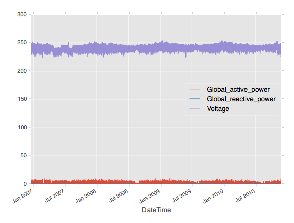
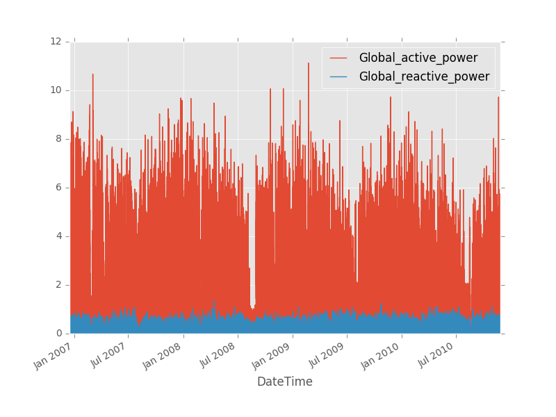
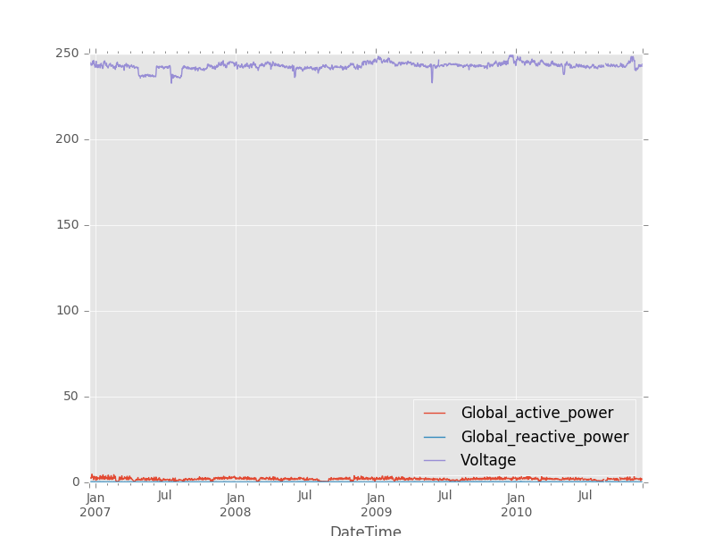

# Time series

For data sources such as usage logs, sensor measurements, and financial instruments,
the presence of a time-stamp results in an implicit temporal ordering on the
observations.

In these applications, it becomes important to be able to treat the time-stamp
as an index around which several important operations can be performed, such as:
- grouping the data with respect to various intervals of time
- aggregating data across time intervals
- aggregating/imputing raw data into regular discrete intervals

The `TimeSeries` object is the fundamental data structure for multivariate time
series data. TimeSeries objects are backed by a single `SFrame`, but include
extra metadata.


|   $$T$$   |  $$V_1$$   |  $$V_2$$   | $$...$$ |  $$V_k$$   |
|-----------|------------|------------|---------|------------|
| $$t_{1}$$ | $$v_{11}$$ | $$v_{21}$$ | $$...$$ | $$v_{k1}$$ |
| $$t_{2}$$ | $$v_{12}$$ | $$v_{22}$$ | $$...$$ | $$v_{k2}$$ |
| $$t_{3}$$ | $$v_{13}$$ | $$v_{23}$$ | $$...$$ | $$v_{k3}$$ |
| $$...$$   |  $$...$$   | $$...$$    | $$...$$ | $$...$$    |
| $$...$$   |  $$...$$   | $$...$$    | $$...$$ | $$...$$    |
| $$t_{n}$$ | $$v_{1n}$$ | $$v_{2n}$$ | $$...$$ | $$v_{kn}$$ |


Each column pair $$(V_i, T)$$ in the table corresponds to a univariate time
series. The $$V_i$$ is the value column for $$T$$, which is the index column that is
shared among all the single (univariate) time series.

In this chapter, we will use a dataset obtained from the [UCI machine learning
repository](https://archive.ics.uci.edu/ml/datasets/Individual+household+electric+power+consumption).
The dataset contains measurements of electric power consumption in one
household with a one-minute sampling rate over a period of almost 4 years. The
entire dataset contains around 2,075,259 measurements gathered between December
2006 and November 2010 (47 months). The dataset is stored as an SFrame that can
be loaded as follows:


```python
import graphlab as gl
household_data = gl.SFrame("http://s3.amazonaws.com/dato-datasets/household_electric_sample.sf")
```

```no-highlight
Data:
+---------------------+-----------------------+---------+---------------------+
| Global_active_power | Global_reactive_power | Voltage |       DateTime      |
+---------------------+-----------------------+---------+---------------------+
|        4.216        |         0.418         |  234.84 | 2006-12-16 17:24:00 |
|        5.374        |         0.498         |  233.29 | 2006-12-16 17:26:00 |
|        3.666        |         0.528         |  235.68 | 2006-12-16 17:28:00 |
|         3.52        |         0.522         |  235.02 | 2006-12-16 17:29:00 |
|         3.7         |          0.52         |  235.22 | 2006-12-16 17:31:00 |
|        3.668        |          0.51         |  233.99 | 2006-12-16 17:32:00 |
|         3.27        |         0.152         |  236.73 | 2006-12-16 17:40:00 |
|        3.728        |          0.0          |  235.84 | 2006-12-16 17:43:00 |
|        5.894        |          0.0          |  232.69 | 2006-12-16 17:44:00 |
|        7.026        |          0.0          |  232.21 | 2006-12-16 17:46:00 |
+---------------------+-----------------------+---------+---------------------+
[1025260 rows x 4 columns]
```

#### Time series construction

We construct a `TimeSeries` object from the SFrame `household_data` by
specifying the `DateTime` column as the index column. The data is **sorted** by
the `DateTime` column when indexed into a time series.


```python
household_ts = gl.TimeSeries(household_data, index="DateTime")
```
```no-highlight
The index column of the TimeSeries is: DateTime
+---------------------+---------------------+-----------------------+---------+
|       DateTime      | Global_active_power | Global_reactive_power | Voltage |
+---------------------+---------------------+-----------------------+---------+
| 2006-12-16 17:24:00 |        4.216        |         0.418         |  234.84 |
| 2006-12-16 17:26:00 |        5.374        |         0.498         |  233.29 |
| 2006-12-16 17:28:00 |        3.666        |         0.528         |  235.68 |
| 2006-12-16 17:29:00 |         3.52        |         0.522         |  235.02 |
| 2006-12-16 17:31:00 |         3.7         |          0.52         |  235.22 |
| 2006-12-16 17:32:00 |        3.668        |          0.51         |  233.99 |
| 2006-12-16 17:40:00 |         3.27        |         0.152         |  236.73 |
| 2006-12-16 17:43:00 |        3.728        |          0.0          |  235.84 |
| 2006-12-16 17:44:00 |        5.894        |          0.0          |  232.69 |
| 2006-12-16 17:46:00 |        7.026        |          0.0          |  232.21 |
+---------------------+---------------------+-----------------------+---------+
[1025260 rows x 4 columns]
```

The following figure illustrates the multivariate time series. The index column
`DateTime` is the x-axis and the columns `Global_active_power`,
`Global_reactive_power`, and `Voltage` are illustrated in the y-axis.

[](images/constructing-time-series.png)

Now, the dataset is indexed by the column `Datetime` and all future operations
involving time are now optimized. At any point of time, the time series can be
**converted to an SFrame** using the `to_sframe` function at **zero cost**.

```python
sf = household_ts.to_sframe()
```

Note that each column in the `TimeSeries` object is an **SArray**. A subset
of columns can be selected as follows:

```python
ts_power = household_ts[['Global_reactive_power', 'Global_reactive_power']]
```
The following figure illustrates the time series `ts_power`.

[](images/selecting-time-series.png)


#### Resampling

In many practical time series analysis problems, we require observations to be
over uniform time intervals. However, data is often in the form of non-uniform
events with accompanying time stamps. As a result, one common prerequisite for
time series applications is to convert any time series that is potentially
irregularly sampled to one that is sampled at a regular frequency (or to a
frequency different from the input data source).


There are three important primitive operations required for this purpose:

- **Mapping** – The operation that determines which time slice a specific
  observation belongs to.
- **Interpolation/Upsampling** – The operation used to fill in the missing
  values when there are no observations that map to a particular time slice.
- **Aggregation/Downsampling** –The operation used to aggregate multiple
  observations that belong to the same time slice.

As an example, we resample the `household_ts` into a time series at an hourly
granularity.

```python
import datetime as dt

day = dt.timedelta(days = 1)
daily_ts = household_ts.resample(day, downsample_method='max', upsample_method=None)
```
```no-highlight
+---------------------+---------------------+-----------------------+---------+
|       DateTime      | Global_active_power | Global_reactive_power | Voltage |
+---------------------+---------------------+-----------------------+---------+
| 2006-12-16 00:00:00 |        7.026        |         0.528         |  243.73 |
| 2006-12-17 00:00:00 |         6.58        |         0.582         |  249.07 |
| 2006-12-18 00:00:00 |        5.436        |         0.646         |  248.48 |
| 2006-12-19 00:00:00 |         7.84        |         0.606         |  248.89 |
| 2006-12-20 00:00:00 |        5.988        |         0.482         |  249.48 |
| 2006-12-21 00:00:00 |        5.614        |         0.688         |  247.08 |
| 2006-12-22 00:00:00 |        7.884        |         0.622         |  248.82 |
| 2006-12-23 00:00:00 |        8.698        |         0.724         |  246.77 |
| 2006-12-24 00:00:00 |        6.498        |         0.494         |  249.27 |
| 2006-12-25 00:00:00 |        6.702        |          0.7          |  250.62 |
+---------------------+---------------------+-----------------------+---------+
[1442 rows x 4 columns]
```

The following figure illustrates the resampled time series `daily_ts`.

[](images/selecting-time-series.png)

In this example, the **mapping** is performed by choosing intervals of length
**1 hour**, the **downsampling** method is chosen by returning the **maximum**
value (for each column) of all the data points in the original time series, the
**upsampling** method sets a `None` value (for a column) corresponding to an
interval in the returned time series if there are no any values (for that
column) within that time interval in the original time series.

#### Shifting time series data

Time series data can also be shifted along the time dimension using the
`TimeSeries.shift` and `TimeSeries.tshift` methods.

The `tshift` operator shifts the index column of the time series along the time
dimension while keeping other columns intact.  For example, we can shift the
`household_ts` by 5 minutes, so all the tuples by an hour:

```python
interval = dt.timedelta(hours = 1)
shifted_ts = household_ts.tshift(interval)
```

```
+---------------------+---------------------+-----------------------+---------+
|       DateTime      | Global_active_power | Global_reactive_power | Voltage |
+---------------------+---------------------+-----------------------+---------+
| 2006-12-16 18:24:00 |        4.216        |         0.418         |  234.84 |
| 2006-12-16 18:26:00 |        5.374        |         0.498         |  233.29 |
| 2006-12-16 18:28:00 |        3.666        |         0.528         |  235.68 |
| 2006-12-16 18:29:00 |         3.52        |         0.522         |  235.02 |
| 2006-12-16 18:31:00 |         3.7         |          0.52         |  235.22 |
| 2006-12-16 18:32:00 |        3.668        |          0.51         |  233.99 |
| 2006-12-16 18:40:00 |         3.27        |         0.152         |  236.73 |
| 2006-12-16 18:43:00 |        3.728        |          0.0          |  235.84 |
| 2006-12-16 18:44:00 |        5.894        |          0.0          |  232.69 |
| 2006-12-16 18:46:00 |        7.026        |          0.0          |  232.21 |
+---------------------+---------------------+-----------------------+---------+
[1025260 rows x 8 columns]
```

The `shift` operator shifts forward/backward all the value columns while
keeping the index column intact.  Notice that this operator does not change the
*range* of the TimeSeries object and it fills those edge tuples that lost their
value with `None`.

```python
shifted_ts = household_ts.shift(steps = 3)
```

```no-highlight
+---------------------+---------------------+-----------------------+---------+
|       DateTime      | Global_active_power | Global_reactive_power | Voltage |
+---------------------+---------------------+-----------------------+---------+
| 2006-12-16 17:24:00 |         None        |          None         |   None  |
| 2006-12-16 17:26:00 |         None        |          None         |   None  |
| 2006-12-16 17:28:00 |         None        |          None         |   None  |
| 2006-12-16 17:29:00 |        4.216        |         0.418         |  234.84 |
| 2006-12-16 17:31:00 |        5.374        |         0.498         |  233.29 |
| 2006-12-16 17:32:00 |        3.666        |         0.528         |  235.68 |
| 2006-12-16 17:40:00 |         3.52        |         0.522         |  235.02 |
| 2006-12-16 17:43:00 |         3.7         |          0.52         |  235.22 |
| 2006-12-16 17:44:00 |        3.668        |          0.51         |  233.99 |
| 2006-12-16 17:46:00 |         3.27        |         0.152         |  236.73 |
+---------------------+---------------------+-----------------------+---------+
[1025260 rows x 8 columns]
```

#### Index Join

Another important feature of TimeSeries objects in GraphLab Create is the
ability to efficiently join them across the index column.  So far we created a
resampled TimeSeries from one of the electeric meters. Now is the time to join
the first resampled TimeSeries object `ts1_resample_3m` with the second
TimeSeries object `electric_meter_ts2`.

```python
sf_other = gl.SFrame('http://s3.amazonaws.com/dato-datasets/household_electric_sample_2.sf')
ts_other = gl.TimeSeries(sf_other, index = 'DateTime')

household_ts.index_join(ts_other, how='inner')
```

```no-highlight
+---------------------+---------------------+-----------------------+---------+
|       DateTime      | Global_active_power | Global_reactive_power | Voltage |
+---------------------+---------------------+-----------------------+---------+
| 2006-12-16 17:24:00 |        4.216        |         0.418         |  234.84 |
| 2006-12-16 17:26:00 |        5.374        |         0.498         |  233.29 |
| 2006-12-16 17:28:00 |        3.666        |         0.528         |  235.68 |
| 2006-12-16 17:29:00 |         3.52        |         0.522         |  235.02 |
| 2006-12-16 17:31:00 |         3.7         |          0.52         |  235.22 |
| 2006-12-16 17:32:00 |        3.668        |          0.51         |  233.99 |
| 2006-12-16 17:40:00 |         3.27        |         0.152         |  236.73 |
| 2006-12-16 17:43:00 |        3.728        |          0.0          |  235.84 |
| 2006-12-16 17:44:00 |        5.894        |          0.0          |  232.69 |
| 2006-12-16 17:46:00 |        7.026        |          0.0          |  232.21 |
+---------------------+---------------------+-----------------------+---------+
+------------------+
| Global_intensity |
+------------------+
|       18.4       |
|       23.0       |
|       15.8       |
|       15.0       |
|       15.8       |
|       15.8       |
|       13.8       |
|       16.4       |
|       25.4       |
|       30.6       |
+------------------+
[1025260 rows x 5 columns]

```

The `how` parameter in `index_join` operator determines the join method. The
acceptable values are 'inner','left','right', and 'outer'. The behavior is
exactly like the **SFrame** join methods.

####  Time series slicing

The range of a time series is defined as the interval `(start, end)` of the
time stamps that span the time series. It can be obtained as follows:

```python
start_time, end_time = household_ts.range
```

```no-highlight
(datetime.datetime(2006, 12, 16, 17, 24), datetime.datetime(2007, 11, 26, 20, 57))
```
We can obtain a slice of a time series that lies within its range using the
`TimeSeries.slice` operator.

```python
import datetime as dt
start = dt.datetime(2006, 12, 16, 17, 24)
end = dt.datetime(2007, 11, 26, 21, 2)

sliced_ts = household_ts.slice(start, end)
```
```no-highlight
+---------------------+---------------------+-----------------------+---------+
|       DateTime      | Global_active_power | Global_reactive_power | Voltage |
+---------------------+---------------------+-----------------------+---------+
| 2006-12-16 17:24:00 |        4.216        |         0.418         |  234.84 |
| 2006-12-16 17:26:00 |        5.374        |         0.498         |  233.29 |
| 2006-12-16 17:28:00 |        3.666        |         0.528         |  235.68 |
| 2006-12-16 17:29:00 |         3.52        |         0.522         |  235.02 |
| 2006-12-16 17:31:00 |         3.7         |          0.52         |  235.22 |
| 2006-12-16 17:32:00 |        3.668        |          0.51         |  233.99 |
| 2006-12-16 17:40:00 |         3.27        |         0.152         |  236.73 |
| 2006-12-16 17:43:00 |        3.728        |          0.0          |  235.84 |
| 2006-12-16 17:44:00 |        5.894        |          0.0          |  232.69 |
| 2006-12-16 17:46:00 |        7.026        |          0.0          |  232.21 |
+---------------------+---------------------+-----------------------+---------+
[246363 rows x 4 columns]
```

We can also `slice` the data for a particular year as follows:


```python
start = dt.datetime(2010,1,1)
end  = dt.datetime(2011,1,1)
ts_2010 = household_ts.slice(start, end)
```
```no-highlight
+---------------------+---------------------+-----------------------+---------+
|       DateTime      | Global_active_power | Global_reactive_power | Voltage |
+---------------------+---------------------+-----------------------+---------+
| 2010-01-01 00:00:00 |         1.79        |         0.236         |  240.65 |
| 2010-01-01 00:01:00 |         1.78        |         0.234         |  240.07 |
| 2010-01-01 00:03:00 |        1.746        |         0.186         |  240.26 |
| 2010-01-01 00:06:00 |         1.68        |          0.1          |  239.72 |
| 2010-01-01 00:07:00 |        1.688        |         0.102         |  240.34 |
| 2010-01-01 00:08:00 |        1.676        |         0.072         |  241.0  |
| 2010-01-01 00:11:00 |        1.618        |          0.0          |  240.11 |
| 2010-01-01 00:13:00 |        1.618        |          0.0          |  240.09 |
| 2010-01-01 00:14:00 |        1.622        |          0.0          |  240.38 |
| 2010-01-01 00:15:00 |        1.622        |          0.0          |  240.4  |
+---------------------+---------------------+-----------------------+---------+
[229027 rows x 4 columns]
```

#### Time series grouping

Quite often in time series analysis, we are required to split a single large
time series into groups of smaller time series grouped based on a property of
the time stamp (e.g. per day of week).

The output of this operator is a `graphlab.timeseries.GroupedTimeSeries`
object, which can be used for retrieving one or more groups, or iterating
through all groups. Each group is a separate time series which possesses the
same columns as the original time series.

In this example, we group the time series `household_ts` by day of the week.

```python
household_ts_groups = household_ts.group(gl.TimeSeries.date_part.WEEKDAY)
print household_ts_groups.groups()
```
```no-highlight
Rows: 7
[0, 1, 2, 3, 4, 5, 6]
```

`household_ts_groups` is a `GroupedTimeSeries` containing 7 groups where each
group is a single TimeSeries.  In this example groups are named between 0 and 6
where 0 is Monday. We can access the data corresponding to a Monday as follows:

```python
household_ts_monday = household_ts_groups.get_group(0)
```
```no-highlight
+---------------------+---------------------+-----------------------+---------+
|       DateTime      | Global_active_power | Global_reactive_power | Voltage |
+---------------------+---------------------+-----------------------+---------+
| 2006-12-18 00:00:00 |        0.278        |         0.126         |  246.17 |
| 2006-12-18 00:03:00 |        0.206        |          0.0          |  245.94 |
| 2006-12-18 00:04:00 |        0.206        |          0.0          |  245.98 |
| 2006-12-18 00:06:00 |        0.204        |          0.0          |  245.22 |
| 2006-12-18 00:07:00 |        0.204        |          0.0          |  244.14 |
| 2006-12-18 00:08:00 |        0.212        |          0.0          |  244.0  |
| 2006-12-18 00:09:00 |        0.316        |         0.134         |  244.62 |
| 2006-12-18 00:10:00 |        0.308        |         0.132         |  244.61 |
| 2006-12-18 00:11:00 |        0.306        |         0.134         |  244.97 |
| 2006-12-18 00:12:00 |        0.306        |         0.136         |  245.51 |
+---------------------+---------------------+-----------------------+---------+
[146934 rows x 4 columns]
```
We can also iterate over all the groups in this GroupedTimeSeries object:
```python
for name, group in household_ts_groups:
  print name, group
```

#### Time series union

We can also merge multiple time series into a single one using the union
operator. The merged time series is a valid time series with the time stamps
sorted correctly. In this example, we will use the `union` operator to re-unite
the time series that we split by the day of the week (using the `group`
operator).

```python
household_ts_combined = household_ts_groups.get_group(0)
for i in range(1, 7):
  group = household_ts_groups.get_group(i)
  household_ts_combined = household_ts_combined.union(group)
```
```no-highlight
+---------------------+---------------------+-----------------------+---------+
|       DateTime      | Global_active_power | Global_reactive_power | Voltage |
+---------------------+---------------------+-----------------------+---------+
| 2006-12-16 17:24:00 |        4.216        |         0.418         |  234.84 |
| 2006-12-16 17:26:00 |        5.374        |         0.498         |  233.29 |
| 2006-12-16 17:28:00 |        3.666        |         0.528         |  235.68 |
| 2006-12-16 17:29:00 |         3.52        |         0.522         |  235.02 |
| 2006-12-16 17:31:00 |         3.7         |          0.52         |  235.22 |
| 2006-12-16 17:32:00 |        3.668        |          0.51         |  233.99 |
| 2006-12-16 17:40:00 |         3.27        |         0.152         |  236.73 |
| 2006-12-16 17:43:00 |        3.728        |          0.0          |  235.84 |
| 2006-12-16 17:44:00 |        5.894        |          0.0          |  232.69 |
| 2006-12-16 17:46:00 |        7.026        |          0.0          |  232.21 |
+---------------------+---------------------+-----------------------+---------+
[1025260 rows x 4 columns]
```

#### Common operations with SFrame/SArray

Because the time series data structure is backed by an SFrame, there are many
operations that behave exactly like the SFrame. These include
- Logical filters (row selection)
- SArray apply functions (univariate user defined functions UDFs)
- Time series apply functions (multivariate UDFs)
- Selecting columns
- Adding, removing, and swapping columns
- Head, tail, row range selection
- Joins (on non-index columns)


See the chapter on SFrame for more usage details on the above functions.

#### Save and Load

Just like every other object, the time series can be saved and loaded as
follows:

```python
household_ts.save("/tmp/first_copy")
household_ts_copy = graphlab.TimeSeries("/tmp/first_copy")
```
