#Visualizing Data
<a name="visualization"></a>
Data visualization can help you explore, understand, and gain insight from your data. Visualization can complement other methods of data analysis by taking advantage of the human ability to recognize patterns in visual information.

**GraphLab Canvas** provides an interactive browser-based visualization platform to explore your data. The data structures that support visualization in Canvas include `SFrame`, `SArray`, and `SGraph`. Each of these data structures can be shown in Canvas by calling the `show` method on an instance of one of those types. Canvas supports two render targets: `'browser'` (the interactive browser-based experience) and `'ipynb'` (visualizations are embedded in an IPython Notebook output cell).

#### SFrame Visualization

Data in an SFrame can be visualized with [`SFrame.show()`](https://dato.com/products/create/docs/generated/graphlab.SFrame.show.html). Table and Summary are the two types of visualizations[^1] for SFrame, each represented by a tab in the Canvas user interface. The Table view provides a scrollable, interactive tabular view of the data inside the SFrame. Like the SFrame itself, the Table view can scale to as much data as will fit on a disk -- only the rows being viewed are loaded. The paging control on the left side of the view allows you to move quickly through the SFrame or jump to a particular row.

[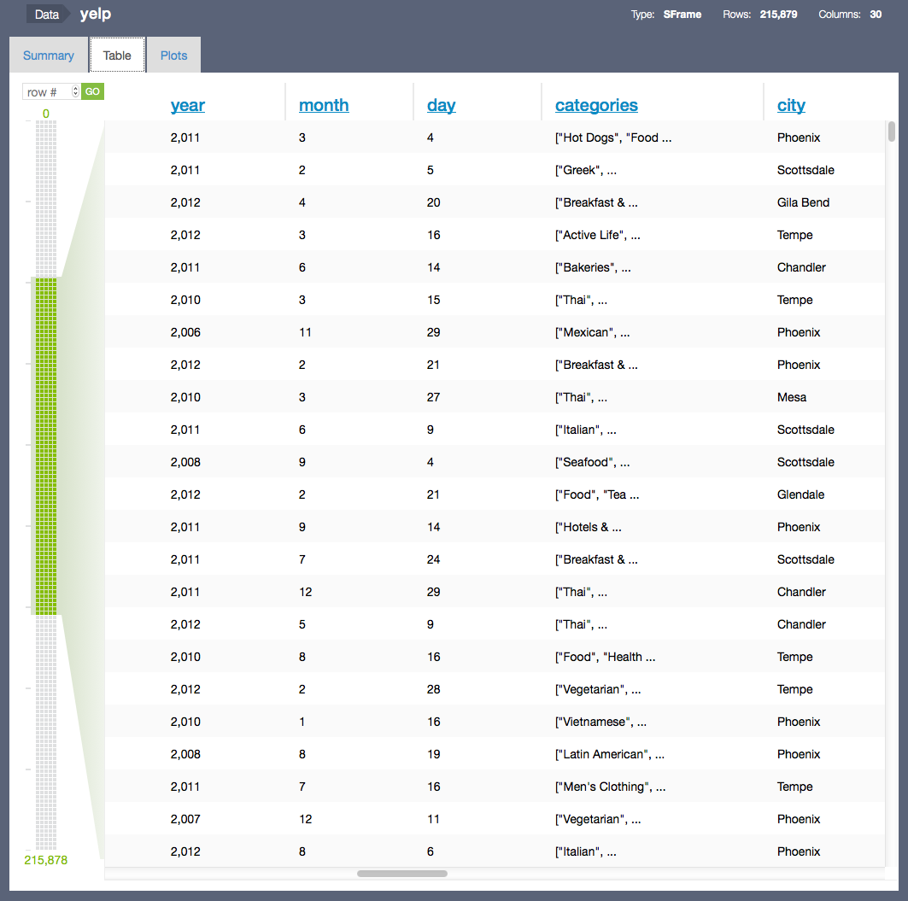](images/sframe_table.png)

The Summary view shows which columns are in the SFrame, with a summary of the data inside each column. Numeric column types (`int` and `float`) show a [box plot](http://en.wikipedia.org/wiki/Box_plot), `str` columns show a table of the most frequently occurring items in the column, and recursive column types (`dict`, `list`, and `array`) show some combination of those plots depending on the type of the underlying data.

[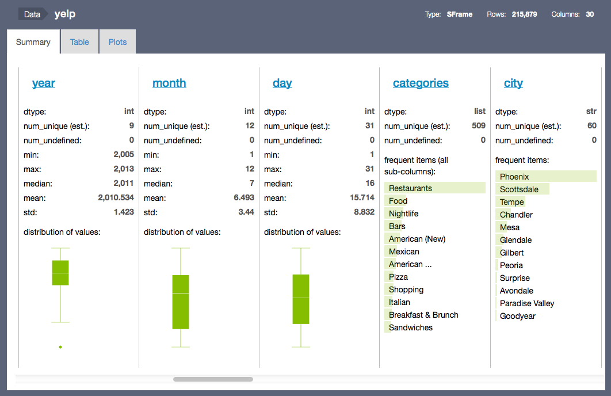](images/sframe_summary.png)

The summary view supports drill-down visualization that any column within it can be visualized by clicking on the corresponding title. For example, clicking on "categories" brings up an SArray view. Below we have more information about how to visualize an SArray programatically.

[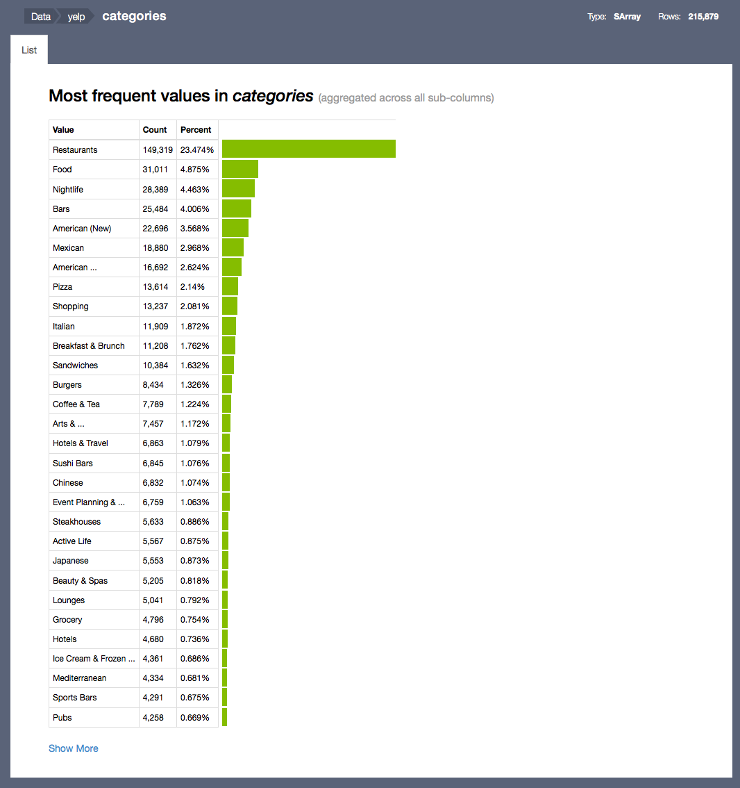](images/sframe_drill_down.png)

SFrame can also be visualized using integrated bi-variate plot types, currently we support Scatter plot, Heatmap, Bar chart, Box plot, and etc. The plot types can either be specified over [API](https://dato.com/products/create/docs/generated/graphlab.SFrame.show.html?highlight=plot "SFrame plot APIs") or explored under the "Plots" tab.

[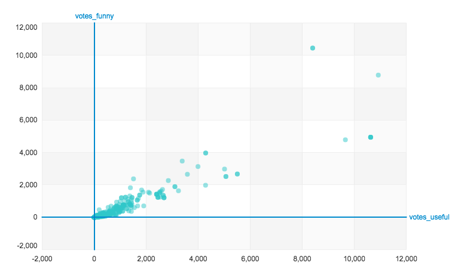](images/sframe_scatter.png)
[](images/sframe_bar.png)

[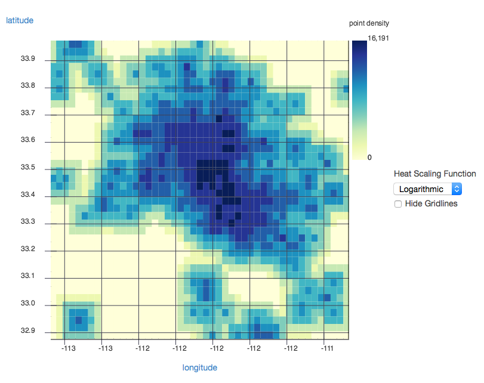](images/sframe_heatmap.png)
[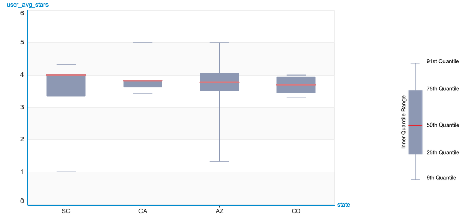](images/sframe_box.png)

#### SArray Visualization

Data in an SArray can be visualized with `SArray.show()`. Canvas has a specialized visualization for each supported `dtype` in `SArray`. The visualization types currently supported (based on column `dtype`) are:

<table class="table table-bordered table-striped">
  <thead>
    <tr>
      <th><code>dtype</code></th>
      <th>Visualization</th>
    </tr>
  </thead>
  <tbody>
    <tr>
      <td><code>float</code></td>
      <td><a href="images/canvas_sarray_numeric.png">Histogram of quantiles</a> (approximated histogram based on <code>sketch_summary</code> quantiles)</td>
    </tr>
    <tr>
      <td><code>int</code></td>
      <td>Histogram of quantiles and (if there are any items with &gt;0.01% occurrence) table of most frequent items</td>
    </tr>
    <tr>
      <td><code>str</code></td>
      <td><a href="images/canvas_sarray_categorical.png">Table of most frequent items</a></td>
    </tr>
    <tr>
      <td><code>array</code></td>
      <td>Histogram of quantiles (aggregate or per-subcolumn)</td>
    </tr>
    <tr>
      <td><code>list</code></td>
      <td>Table of most frequent items (aggregate)</td>
    </tr>
    <tr>
      <td><code>dict</code></td>
      <td><a href="images/canvas_sarray_dict.png">Filterable table</a> of most frequent keys, with aggregate or filtered values visualized according to value <code>dtype</code></td>
    </tr>
  </tbody>
</table>

[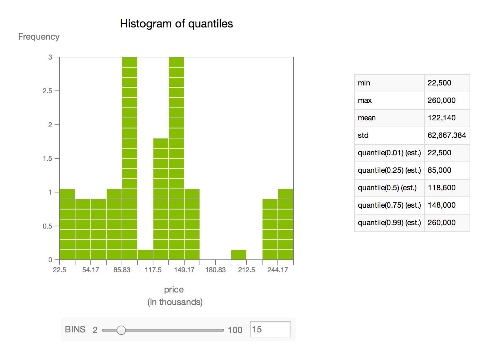](images/canvas_sarray_numeric.png)
[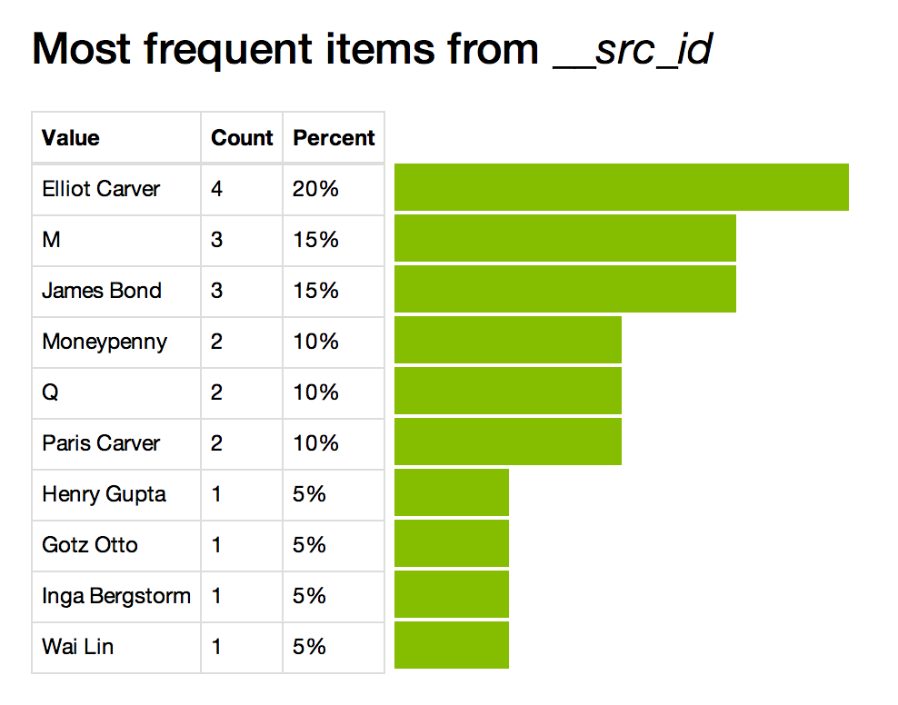](images/canvas_sarray_categorical.png)
[](images/canvas_sarray_dict.png)

#### SGraph Visualization

Graph structure can be visualized with [`SGraph.show()`](https://dato.com/products/create/docs/generated/graphlab.SGraph.show.html). The vertices and edges are laid out in a two-dimensional plot, with vertices drawn as circles and edges as lines between them. The default layout algorithm is force-directed, but it is possible to apply a custom layout algorithm with the `vertex_positions` parameter. In general, [`SGraph.show`](https://dato.com/products/create/docs/generated/graphlab.SGraph.show.html) offers parameterization of the size, position, and color of vertices and edges, which can be used to great effect on graphs representing different types of data.

[](images/canvas_sgraph.png)

#### Model Visualization

Models such as Recommender and Classifier can be visually inspected by calling model.show(). The model visualization provides model summary view, model evaluation view and model comparison view. More details about how to use the model comparison visualization can be found in [`gl.compare()`](https://dato.com/products/create/docs/generated/graphlab.compare.html) and [`gl.show_comparison()`](https://dato.com/products/create/docs/generated/graphlab.show_comparison.html).

The summary view provides basic statistics about the training data as well as the model training time.
[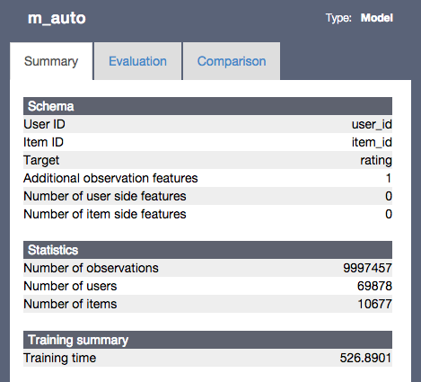](images/model_summary.png)

The model evaluation provide model specific evaluation metrics such as precision-recall. The hover tooltip shows more details about the model performance at a specific cutoff value. The model comparison view shows multiple models in the same view space and offers interactive highlighting to support focused analysis.


[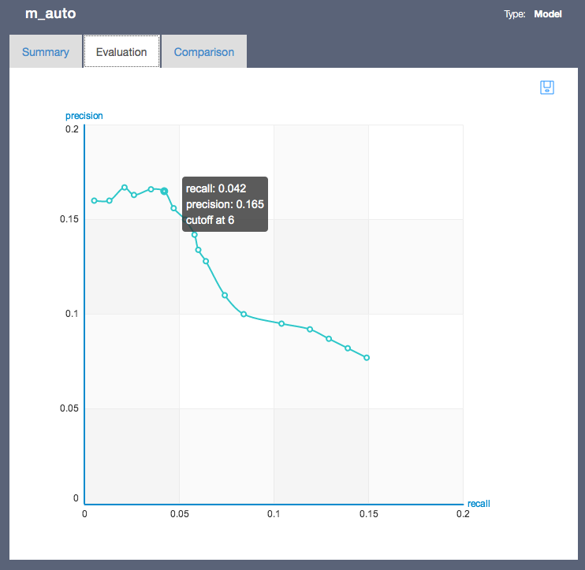](images/model_eval.png)
[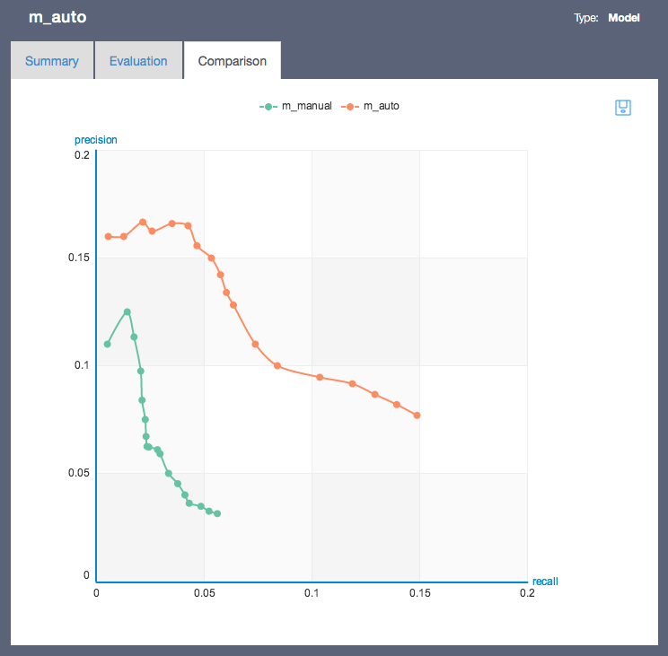](images/model_comparison.png)

#### Integration with other visualization tools

There are many other software tools that can help with different types of data visualization. Integrating with GraphLab Create is easy, since we provide methods on `SFrame`, `SArray`, and `SGraph` to transform and retrieve the underlying data as native Python types. One commonly used Python module for visualization is [matplotlib](http://matplotlib.org/).

Here is an example of a histogram displayed with matplotlib. For this particular use, it might be easier to simply call `show` on a numeric SArray, which will also give a histogram -- this example is intended to demonstrate interoperability with other Python visualization packages.

```python
import numpy as np
from matplotlib import pyplot as plt

sa = gl.SArray([np.random.gamma(1) for _ in range(100000)])
n, bins, patches = plt.hist(list(sa))
plt.plot(bins)
plt.show()
```

[](images/matplotlib_histogram.png)

[^1]: Note: in the `'ipynb'` target, only the Summary visualization of SFrame is supported.
